Predicting Housing Prices in Ames, Iowa
================

<style>
title, h1, h2, h3 {
  color : #0066ff;
}
h4 {
  color : #0066ff;
  font-size: bold;
}
&#10;table, td, th {  
  border: 1px solid black;
  vertical-align: center;
}
&#10;table {
  border-collapse: collapse;
  width: 100%;
}
&#10;th, td {
  padding: 5px;
}
</style>

<title>

Ames Housing Data Analysis
</title>

<h2>

1.  Introduction
    </h2>

This project analyzes the Ames Housing Dataset, which is widely used in
statistics and machine learning, with the goal of building a model to
predict housing prices. The dataset comprises a training set, a test
set, and a validation set.

We begin with a compilation of home search criteria and recommendations
shared by real estate agents online. This knowledge helps us understand
the dataset variables and their relative impact on housing prices.

Next, we perform exploratory data analysis (EDA). We identify missing
data and outliers, and decide how to handle them. We analyze the
variables, their correlations, and the needs for creating new variables
and variable transformations.

Using the training set, We create a linear model and then use AIC and
BIC to compare different sets of predictors.

using AIC/BIC criteria select a set of predictors and build several
types of models. After choosing a model, we evaluate its overfit on the
test set and tune it. Finally, we use the model to identify under- or
over-valued properties in the validation set.

<h2>

2.  What real estate agents say
    </h2>

As it turns out, all real estate agents basically say the same things.
The real estate mantra is ‘location, location, location’, so let’s start
with location.

<h4>

Location
</h4>

<ul>

<li>

<b>Zoning:</b> The choice of a type of area depends on the type of
lifestyle you wish to live and of course, on your budget. Agricultural,
industrial and commercial areas are cheaper than residential areas. Low
density residential areas are generally the most expensive ones.
</li>

<br>
<li>

<b>Ease of access to the property:</b> The road system to get to the
property should be efficient and the traffic fluid enough. Commute times
are an important consideration.
</li>

<br>
<li>

<b>Proximity to shopping areas:</b> You will be spending a lot of time
driving if you don’t have nearby shopping areas. On the other hand, you
may not want to be too close to busy shopping areas.
</li>

<br>
<li>

<b>Safety and crime rates:</b> You certainly don’t want to live in an
unsafe area, especially if you have children.
</li>

<br>
<li>

<b>Schools:</b> In many families, education is everything. Schools drive
home prices in some neighborhoods as many buyers are ready to pay a
premium for good schools.
</li>

<br>
<li>

<b>Neighborhood’s character:</b> A safe and quiet neighborhood, with
clean and tidy yards and welcoming neighbors is the type of place where
most families want to live.
</li>

<br>
<li>

<b>Noise:</b> High levels of noise can have a negative impact on your
quality of life, and even on your health. Houses alongside busy
boulevards or close to highways or railroads are cheaper.
</li>

<br>
<li>

<b>Access to public transportation:</b> Public transportation can save
you money you would spend on a car. If you live in a residential area,
having a train nearby that takes you to the city center is a real
advantage.
</li>

<br>
<li>

<b>Investment value:</b> If you are planning to sell the house after
some time and make a profit, you want to look for development areas. If
you are planning to rent the property, you want to look for a house that
is attractive to tenants.
</li>

</ul>

<h4>

Type of house
</h4>

<p>

Single story houses are easier and safer to navigate as they have no
stairs. A second floor makes for an easier separation of public and
private spaces, but it also comes with costlier heating and cooling, and
potentially higher noise levels if the house was not properly designed
and constructed. A basement is something some people will be ready to
pay for if they need a lot of storage room, have hobbies that require
space, or have expansion projects.
</p>

<p>

Town houses are an intermediate choice between an apartment and a
detached house. They are usually cheaper than detached houses but are
less spacious, have no land and provide less privacy.
</p>

<h4>

Lot features
</h4>

<p>

For most people, a bigger lot is better because it means more space.
</p>

<p>

The lot shape is important to consider. The lot may be large but an
irregular shape may waste space and create inconvenient or unwelcoming
areas. A smaller lot with a regular shape may be better.
</p>

<p>

The slope of the lot is also an important factor. Severe slopes often
come with steep garage ramps and lack of flat land for outdoor
activities. Having a deck can somewhat compensate for that.
</p>

<h4>

Position of the house on the lot
</h4>

<p>

A property feels more spacious if the house is at the center of the lot.
</p>

Being closer to the property lines may also mean being closer to your
neighbors. They may be noisy people. Their windows may face yours
meaning less privacy for you.
</p>

<h4>

Age of the property
</h4>

<p>

Older homes can have a character that appeals. But they have higher
maintenance costs and may need more frequent repairs. The floorplan may
be outdated. Closets may be too small and storage room insufficient. The
garage may be inconveniently small and may not accommodate more than one
car. Non conformity to building codes can be an issue.
</p>

<p>

More recent houses tend to have greater square footage. They have more
open floorplans, more spacious and inviting bathrooms, more storage
room, and larger garages. They require less maintenance and are built to
codes. They are also more energy efficient.
</p>

<h4>

Construction quality and condition of the house
</h4>

<p>

Quality of construction and condition of the house are of paramount
importance for most buyers. You don’t want to buy a house that has major
construction flaws that would be extremely costly or impossible to fix,
for example an inadequate foundation. You also don’t want to buy a house
that will need repairs as soon as you move in, for example rebuilding
the roof.
</p>

<h4>

Number of bedrooms
</h4>

<p>

Most families of four want to have three bedrooms so that children don’t
have to share the same bedroom. Having an extra bedroom for guests may
be desirable if you frequently have visitors who stay for some length of
time. An extra bedroom may also serve as an office, a storage room or an
exercise room.
</p>

<h4>

Number of bathrooms
</h4>

<p>

Not having enough bathrooms is a showstopper for many buyers. If you
have three bedrooms, you should have two bathrooms. People don’t want to
wait for their turn to take a shower in the morning. If you have four
bedrooms or more, you may want to have more than two bathrooms.
Bathrooms should be spacious and inviting. Cramped bathrooms can be an
instant turnoff.
</p>

<h4>

Floorplan
</h4>

<p>

Floorplans are often at the top of the list for buyers. They will assess
how they will use the home and how it will fit the needs of the family.
They may look for a flexible floorplan that will easily accommodate the
needs of a growing family and then a shrinking family. The layout of the
kitchen is particularly important for people who like to cook or have
breakfast in the kitchen with their children.
</p>

<h4>

Garages
</h4>

Most families have 2 cars or more, so the garage must accommodate at
least 2 cars. Spacious garages provide extra room for storage and
appliances, and even for some hobbies if large enough. Garages attached
to the house are preferred. Not having a garage is a showstopper for
many buyers.

<h2>

3.  Loading the training data
    </h2>

We first load the packages we are going to need. Then, we load the
training data and take a look at the variables.

``` r
library(dplyr)
library(ggplot2)
library(statsr)
library(formattable)
library(GGally)
library(MASS)

# Load the training data
load("ames_train.Rdata")
str(ames_train)
```

    ## tibble [1,000 × 81] (S3: tbl_df/tbl/data.frame)
    ##  $ PID            : int [1:1000] 909176150 905476230 911128020 535377150 534177230 908128060 902135020 528228540 923426010 908186050 ...
    ##  $ area           : int [1:1000] 856 1049 1001 1039 1665 1922 936 1246 889 1072 ...
    ##  $ price          : int [1:1000] 126000 139500 124900 114000 227000 198500 93000 187687 137500 140000 ...
    ##  $ MS.SubClass    : int [1:1000] 30 120 30 70 60 85 20 20 20 180 ...
    ##  $ MS.Zoning      : Factor w/ 7 levels "A (agr)","C (all)",..: 6 6 2 6 6 6 7 6 6 7 ...
    ##  $ Lot.Frontage   : int [1:1000] NA 42 60 80 70 64 60 53 74 35 ...
    ##  $ Lot.Area       : int [1:1000] 7890 4235 6060 8146 8400 7301 6000 3710 12395 3675 ...
    ##  $ Street         : Factor w/ 2 levels "Grvl","Pave": 2 2 2 2 2 2 2 2 2 2 ...
    ##  $ Alley          : Factor w/ 2 levels "Grvl","Pave": NA NA NA NA NA NA 2 NA NA NA ...
    ##  $ Lot.Shape      : Factor w/ 4 levels "IR1","IR2","IR3",..: 4 4 4 4 4 4 4 4 4 4 ...
    ##  $ Land.Contour   : Factor w/ 4 levels "Bnk","HLS","Low",..: 4 4 4 4 4 4 1 4 4 4 ...
    ##  $ Utilities      : Factor w/ 3 levels "AllPub","NoSeWa",..: 1 1 1 1 1 1 1 1 1 1 ...
    ##  $ Lot.Config     : Factor w/ 5 levels "Corner","CulDSac",..: 1 5 5 1 5 1 5 5 1 5 ...
    ##  $ Land.Slope     : Factor w/ 3 levels "Gtl","Mod","Sev": 1 1 1 1 1 1 2 1 1 1 ...
    ##  $ Neighborhood   : Factor w/ 28 levels "Blmngtn","Blueste",..: 26 8 12 21 20 8 21 1 15 8 ...
    ##  $ Condition.1    : Factor w/ 9 levels "Artery","Feedr",..: 3 3 3 3 3 3 3 3 3 3 ...
    ##  $ Condition.2    : Factor w/ 8 levels "Artery","Feedr",..: 3 3 3 3 3 3 3 3 3 3 ...
    ##  $ Bldg.Type      : Factor w/ 5 levels "1Fam","2fmCon",..: 1 5 1 1 1 1 2 1 1 5 ...
    ##  $ House.Style    : Factor w/ 8 levels "1.5Fin","1.5Unf",..: 3 3 3 6 6 7 3 3 3 7 ...
    ##  $ Overall.Qual   : int [1:1000] 6 5 5 4 8 7 4 7 5 6 ...
    ##  $ Overall.Cond   : int [1:1000] 6 5 9 8 6 5 4 5 6 5 ...
    ##  $ Year.Built     : int [1:1000] 1939 1984 1930 1900 2001 2003 1953 2007 1984 2005 ...
    ##  $ Year.Remod.Add : int [1:1000] 1950 1984 2007 2003 2001 2003 1953 2008 1984 2005 ...
    ##  $ Roof.Style     : Factor w/ 6 levels "Flat","Gable",..: 2 2 4 2 2 2 2 2 2 2 ...
    ##  $ Roof.Matl      : Factor w/ 8 levels "ClyTile","CompShg",..: 2 2 2 2 2 2 2 2 2 2 ...
    ##  $ Exterior.1st   : Factor w/ 16 levels "AsbShng","AsphShn",..: 15 7 9 9 14 7 9 16 7 14 ...
    ##  $ Exterior.2nd   : Factor w/ 17 levels "AsbShng","AsphShn",..: 16 7 9 9 15 7 9 17 11 15 ...
    ##  $ Mas.Vnr.Type   : Factor w/ 6 levels "","BrkCmn","BrkFace",..: 5 3 5 5 5 3 5 3 5 6 ...
    ##  $ Mas.Vnr.Area   : int [1:1000] 0 149 0 0 0 500 0 20 0 76 ...
    ##  $ Exter.Qual     : Factor w/ 4 levels "Ex","Fa","Gd",..: 4 3 3 3 3 3 2 3 4 4 ...
    ##  $ Exter.Cond     : Factor w/ 5 levels "Ex","Fa","Gd",..: 5 5 5 3 5 5 5 5 5 5 ...
    ##  $ Foundation     : Factor w/ 6 levels "BrkTil","CBlock",..: 2 2 1 1 3 4 2 3 2 3 ...
    ##  $ Bsmt.Qual      : Factor w/ 6 levels "","Ex","Fa","Gd",..: 6 4 6 3 4 NA 3 4 6 4 ...
    ##  $ Bsmt.Cond      : Factor w/ 6 levels "","Ex","Fa","Gd",..: 6 6 6 6 6 NA 6 6 6 6 ...
    ##  $ Bsmt.Exposure  : Factor w/ 5 levels "","Av","Gd","Mn",..: 5 4 5 5 5 NA 5 3 5 3 ...
    ##  $ BsmtFin.Type.1 : Factor w/ 7 levels "","ALQ","BLQ",..: 6 4 2 7 4 NA 7 7 2 4 ...
    ##  $ BsmtFin.SF.1   : int [1:1000] 238 552 737 0 643 0 0 0 647 467 ...
    ##  $ BsmtFin.Type.2 : Factor w/ 7 levels "","ALQ","BLQ",..: 7 2 7 7 7 NA 7 7 7 7 ...
    ##  $ BsmtFin.SF.2   : int [1:1000] 0 393 0 0 0 0 0 0 0 0 ...
    ##  $ Bsmt.Unf.SF    : int [1:1000] 618 104 100 405 167 0 936 1146 217 80 ...
    ##  $ Total.Bsmt.SF  : int [1:1000] 856 1049 837 405 810 0 936 1146 864 547 ...
    ##  $ Heating        : Factor w/ 6 levels "Floor","GasA",..: 2 2 2 2 2 2 2 2 2 2 ...
    ##  $ Heating.QC     : Factor w/ 5 levels "Ex","Fa","Gd",..: 5 5 1 3 1 1 5 1 5 1 ...
    ##  $ Central.Air    : Factor w/ 2 levels "N","Y": 2 2 2 2 2 2 1 2 2 2 ...
    ##  $ Electrical     : Factor w/ 6 levels "","FuseA","FuseF",..: 6 6 6 6 6 6 6 6 6 6 ...
    ##  $ X1st.Flr.SF    : int [1:1000] 856 1049 1001 717 810 495 936 1246 889 1072 ...
    ##  $ X2nd.Flr.SF    : int [1:1000] 0 0 0 322 855 1427 0 0 0 0 ...
    ##  $ Low.Qual.Fin.SF: int [1:1000] 0 0 0 0 0 0 0 0 0 0 ...
    ##  $ Bsmt.Full.Bath : int [1:1000] 1 1 0 0 1 0 0 0 0 1 ...
    ##  $ Bsmt.Half.Bath : int [1:1000] 0 0 0 0 0 0 0 0 0 0 ...
    ##  $ Full.Bath      : int [1:1000] 1 2 1 1 2 3 1 2 1 1 ...
    ##  $ Half.Bath      : int [1:1000] 0 0 0 0 1 0 0 0 0 0 ...
    ##  $ Bedroom.AbvGr  : int [1:1000] 2 2 2 2 3 4 2 2 3 2 ...
    ##  $ Kitchen.AbvGr  : int [1:1000] 1 1 1 1 1 1 1 1 1 1 ...
    ##  $ Kitchen.Qual   : Factor w/ 5 levels "Ex","Fa","Gd",..: 5 3 3 5 3 3 5 3 5 3 ...
    ##  $ TotRms.AbvGrd  : int [1:1000] 4 5 5 6 6 7 4 5 6 5 ...
    ##  $ Functional     : Factor w/ 8 levels "Maj1","Maj2",..: 8 8 8 8 8 8 4 8 8 8 ...
    ##  $ Fireplaces     : int [1:1000] 1 0 0 0 0 1 0 1 0 0 ...
    ##  $ Fireplace.Qu   : Factor w/ 5 levels "Ex","Fa","Gd",..: 3 NA NA NA NA 1 NA 3 NA NA ...
    ##  $ Garage.Type    : Factor w/ 6 levels "2Types","Attchd",..: 6 2 6 6 2 4 6 2 2 3 ...
    ##  $ Garage.Yr.Blt  : int [1:1000] 1939 1984 1930 1940 2001 2003 1974 2007 1984 2005 ...
    ##  $ Garage.Finish  : Factor w/ 4 levels "","Fin","RFn",..: 4 2 4 4 2 3 4 2 4 2 ...
    ##  $ Garage.Cars    : int [1:1000] 2 1 1 1 2 2 2 2 2 2 ...
    ##  $ Garage.Area    : int [1:1000] 399 266 216 281 528 672 576 428 484 525 ...
    ##  $ Garage.Qual    : Factor w/ 6 levels "","Ex","Fa","Gd",..: 6 6 6 6 6 6 6 6 6 6 ...
    ##  $ Garage.Cond    : Factor w/ 6 levels "","Ex","Fa","Gd",..: 6 6 5 6 6 6 6 6 6 6 ...
    ##  $ Paved.Drive    : Factor w/ 3 levels "N","P","Y": 3 3 1 1 3 3 3 3 3 3 ...
    ##  $ Wood.Deck.SF   : int [1:1000] 0 0 154 0 0 0 0 100 0 0 ...
    ##  $ Open.Porch.SF  : int [1:1000] 0 105 0 0 45 0 32 24 0 44 ...
    ##  $ Enclosed.Porch : int [1:1000] 0 0 42 168 0 177 112 0 0 0 ...
    ##  $ X3Ssn.Porch    : int [1:1000] 0 0 86 0 0 0 0 0 0 0 ...
    ##  $ Screen.Porch   : int [1:1000] 166 0 0 111 0 0 0 0 0 0 ...
    ##  $ Pool.Area      : int [1:1000] 0 0 0 0 0 0 0 0 0 0 ...
    ##  $ Pool.QC        : Factor w/ 4 levels "Ex","Fa","Gd",..: NA NA NA NA NA NA NA NA NA NA ...
    ##  $ Fence          : Factor w/ 4 levels "GdPrv","GdWo",..: NA NA NA NA NA NA NA NA NA NA ...
    ##  $ Misc.Feature   : Factor w/ 5 levels "Elev","Gar2",..: NA NA NA NA NA NA NA NA NA NA ...
    ##  $ Misc.Val       : int [1:1000] 0 0 0 0 0 0 0 0 0 0 ...
    ##  $ Mo.Sold        : int [1:1000] 3 2 11 5 11 7 2 3 4 5 ...
    ##  $ Yr.Sold        : int [1:1000] 2010 2009 2007 2009 2009 2009 2009 2008 2008 2007 ...
    ##  $ Sale.Type      : Factor w/ 10 levels "COD","Con","ConLD",..: 10 10 10 10 10 3 10 7 10 10 ...
    ##  $ Sale.Condition : Factor w/ 6 levels "Abnorml","AdjLand",..: 5 5 5 5 5 5 5 6 5 5 ...

There are 81 variables in the data set.

Variables Overall.Cond and Overall.Qual are categorical variables but
they are coded as integers. We fix that before moving forward.

For the sake of consistency, we rename variable ‘price’ to ‘Price’ and
variable ‘area’ to ‘Area’.

Most of the time the age of a house is more intuitive than the year it
was built, so we create an age variable that we call Age. We calculate
ages starting from 2010 as we don’t have more recent data points in the
data set.

``` r
ames_train$Overall.Qual  <- as.factor(ames_train$Overall.Qual)
ames_train$Overall.Cond  <- as.factor(ames_train$Overall.Cond)

ames_train <- ames_train %>% dplyr::rename(Price = price, Area = area)

ames_train <- mutate(ames_train, Age = 2010 - Year.Built)
```

<h2>

4.  Properties sold under abnormal conditions
    </h2>

We remove from the data set all the properties that sold under abnormal
conditions such as foreclosures or sale between family members.

Prices are not representative under such sale circumstances.

``` r
ames_train <- ames_train %>% filter(Sale.Condition == "Normal")
cat(sprintf("Data points in training set: %d\n", nrow(ames_train)))
```

    ## Data points in training set: 834

<h2>

5.  Available variables and interpretation
    </h2>

We have 81 variables in total, not counting the Parcel ID that is not
useful to our study.

Let’s try to categorize these variables based on real estate agents’
home search criteria and recommendations.

<table style="text-align: left;">

<tr>

<th>

Property Features
</th>

<th>

Variables
</th>

</tr>

<tr>

<td>

Zoning (Agriculture, commercial, industrial, residential)
<td>

MS.Zoning
</td>

</tr>

<tr>

<td>

Neighborhood
</td>

<td>

Neighborhood
</td>

</tr>

<tr>

<td>

Access to the property
</td>

<td>

Street, Alley, Paved.Drive
</td>

</tr>

<tr>

<td>

Proximity to roads, railroads, parks
</td>

<td>

Condition.1, Condition.2
</td>

</tr>

<tr>

<td>

Lot
</td>

<td>

Lot.Area, Lot.Shape, Lot.Config, Lot.Frontage
</td>

</tr>

<tr>

<td>

Land slope
</td>

<td>

Land.Slope, Land.Contour
</td>

</tr>

<tr>

<td>

Type of house
</td>

<td>

MS.SubClass, Bldg.Type, House.Style
</td>

</tr>

<tr>

<td>

Above grade (ground) living area
</td>

<td>

area
</td>

</tr>

<tr>

<td>

House age
</td>

<td>

Age, Year.Built, Year.Remodel.Add
</td>

</tr>

<tr>

<td>

Overall construction quality and condition
</td>

<td>

Overall.Qual, Overall.Cond
</td>

</tr>

<tr>

<td>

Exterior of the house
</td>

<td>

Exterior.1st, Exterior.2nd, Mas.Vnr.Type, Mas.Vnr.Area, Exter.Qual,
Exter.Cond
</td>

</tr>

<tr>

<td>

Roof style and materials
</td>

<td>

Roof.Style, Roof.Matl
</td>

</tr>

<tr>

<td>

Foundation
</td>

<td>

Foundation
</td>

</tr>

<tr>

<td>

Utilities
</td>

<td>

Utilities
</td>

</tr>

<tr>

<td>

Floor areas
</td>

<td>

X1st.Flr.SF, X2nd.Flr.SF, Low.Qual.Fin.SF
</td>

</tr>

<tr>

<td>

Total number of rooms
</td>

<td>

TotRms.AbvGrd
</td>

</tr>

<tr>

<td>

Bedrooms
</td>

<td>

Bedroom.AbvGr
</td>

</tr>

<tr>

<td>

Bathrooms
</td>

<td>

Bsmt.Full.Bath, Bsmt.Half.Bath, Full.Bath, Half.Bath
</td>

</tr>

<tr>

<td>

Kitchen
</td>

<td>

Kitchen.AbvGr, Kitchen.Qual
</td>

</tr>

<tr>

<td>

Basement
</td>

<td>

Bsmt Qual, Bsmt.Cond, Bsmt.Exposure, BsmtFin.Type.1, BsmtFin.SF.1,
BsmtFin.Type.2, BsmtFin.SF.2, Bsmt.Unf.SF, Total.Bsmt.SF
</td>

</tr>

<tr>

<td>

Garage
</td>

<td>

Garage.Type, Garage.Yr.Blt, Garage.Finish, Garage.Cars, Garage.Area,
Garage.Qual, Garage.Cond
</td>

</tr>

<tr>

<td>

Home functionality
</td>

<td>

Functional
</td>

</tr>

<tr>

<td>

Heating system type, quality and condition
</td>

<td>

Heating, Heating.QC
</td>

</tr>

<tr>

<td>

Air conditioning
</td>

<td>

Central.Air
</td>

</tr>

<tr>

<td>

Electrical system
</td>

<td>

Electrical
</td>

</tr>

<tr>

<td>

Fireplaces
</td>

<td>

Fireplaces, Fireplace.Qu
</td>

</tr>

<tr>

<td>

Wood deck
</td>

<td>

Wood.Deck.SF
</td>

</tr>

<tr>

<td>

Porches
</td>

<td>

Open.Porch.SF, Enclosed.Porch, X3-Ssn.Porch, Screen.Porch
</td>

</tr>

<tr>

<td>

Pool
</td>

<td>

Pool.Area, Pool.QC
</td>

</tr>

<tr>

<td>

Fence
</td>

<td>

Fence
</td>

</tr>

<tr>

<td>

Miscellaneous
</td>

<td>

Misc.Feature, Misc.Val
</td>

</tr>

<tr>

<td>

Sale information
</td>

<td>

Price, Mo Sold, Yr.Sold, Sale.type, Sale.Condition
</td>

</tr>

</table>

<br>

The variable ‘area’ in the dataset is not in the codebook, and the
variable ‘Gr Liv Area’ in the codebook is not in the dataset. We assume
that they are the same, providing the above grade (ground) living area.

We note that the available variables closely match our compilation of
home search criteria and recommendations from real estate agents.

<h4>

Neighborhoods
</h4>

Besides their names, no information about neighborhoods is readily
available in the data set.

The name of a neighborhood may be enough information for real estate
agents who are intimately familiar with the area, but how do we know
about ease of access to the property, proximity to jobs, proximity to
shopping areas, schools, crime rates, availability of public
transportation, noise levels and investment value?

MS.Zoning provides some information about the type of neighborhood each
property is in. This variable can take the following values:

<pre>
<b>MS.Zoning (general zoning classification):</b>
   A          Agriculture
   C          Commercial
   FV         Floating Village Residential
   I          Industrial
   RH         Residential High Density
   RL         Residential Low Density
   RM         Residential Medium Density
</pre>

In the EDA part, we will use this variable to try to get some
understanding about the type of area each neighborhood name implies.

<h4>

Type and style of dwelling
</h4>

There are 3 variables that describe the type and style of dwelling:
MS.SubClass, Bldg.Type and House.Style.

These variables can take the following values:

<pre>
<b>MS.SubClass (type of dwelling):</b>
   020        1-story 1946 & Newer all styles
   030        1-story 1945 & Older
   040        1-story w/finished attic all ages
   045        1-1/2 story - Unfinished all ages
   050        1-1/2 story finished all ages
   060        2-story 1946 & Newer
   070        2-story 1945 & Older
   075        2-1/2 story - All ages
   080        Split or multi-level
   085        Split foyer
   090        Duplex - All styles and ages
   120        1-story PUD (Planned Unit Development) - 1946 & newer
   150        1-1/2 story PUD - All ages
   160        2-story PUD - 1946 & newer
   180        PUD - Multilevel - Incl split lev/foyer
   190        2 family conversion - All styles and ages
&#10;<b>Bldg.Type (type of dwelling):</b>
   1Fam       Single-family Detached
   2FmCon     Two-family Conversion; originally built as one-family dwelling
   Duplx      Duplex
   TwnhsE     Townhouse End Unit
   TwnhsI     Townhouse Inside Unit
&#10;<b>House.Style (Style of dwelling):</b>
   1Story     One story
   1.5Fin     One and one-half story: 2nd level finished
   1.5Unf     One and one-half story: 2nd level unfinished
   2Story     Two story</li>
   2.5Fin     Two and one-half story: 2nd level finished
   2.5Unf     Two and one-half story: 2nd level unfinished
   SFoyer     Split Foyer</li>
   SLvl       Split Level</li>
</pre>

Bldg.Type and House.Style complement each other nicely, but MS.SubClass
is somewhat confusing.

MS.SubClass mixes information about stories, floorplan, style, age,
finished/unfinished areas, and planned development. It significantly
overlaps with Bldg.Type and House.Style and the information it adds on
top of them is not always easy to understand.

<h4>

Proximity to some conditions
</h4>

Condition.1 and Condition.2 provide information that is local to the
property.

These variables can take the following values:

<pre>
<b>Condition.1 and Condition.2 (Proximity to various conditions):</b>
   Artery     Adjacent to arterial street
   Feedr      Adjacent to feeder street
   Norm       Normal
   RRNn       Within 200' of North-South Railroad
   RRAn       Adjacent to North-South Railroad
   PosN       Near positive off-site feature--park, greenbelt, etc.
   PosA       Adjacent to positive off-site feature
   RRNe       Within 200' of East-West Railroad
   RRAe       Adjacent to East-West Railroad
</pre>

Condition.1 and Condition.2 certainly provide valuable information. But
the problem with these variables is that it is not obvious to understand
what is good and what is bad. For example, is it good to be “Within 200’
of East-West Railroad” because there is a train station nearby, or is it
bad because noise levels are high?

<h4>

Basements
</h4>

There is an impressive amount of information about basements: 9
variables in total.

Basements must be a big deal in Ames. We will see if it gets confirmed
when we develop our model.

<h2>

6.  Undefined variable values
    </h2>

Undefined variable values cannot be used in models.

Therefore, we have to identify the variables that have undefined values
and determine what we should do with these values. Simply dropping data
points that have undefined values may not be the right thing to do. It
may be damaging to our model.

``` r
na_count <- sapply(ames_train, function(x) sum(is.na(x)))
na <- as.data.frame(na_count)
na <- data.frame(Variable=rownames(na), Missing=na$na_count)
na
```

    ##           Variable Missing
    ## 1              PID       0
    ## 2             Area       0
    ## 3            Price       0
    ## 4      MS.SubClass       0
    ## 5        MS.Zoning       0
    ## 6     Lot.Frontage     156
    ## 7         Lot.Area       0
    ## 8           Street       0
    ## 9            Alley     781
    ## 10       Lot.Shape       0
    ## 11    Land.Contour       0
    ## 12       Utilities       0
    ## 13      Lot.Config       0
    ## 14      Land.Slope       0
    ## 15    Neighborhood       0
    ## 16     Condition.1       0
    ## 17     Condition.2       0
    ## 18       Bldg.Type       0
    ## 19     House.Style       0
    ## 20    Overall.Qual       0
    ## 21    Overall.Cond       0
    ## 22      Year.Built       0
    ## 23  Year.Remod.Add       0
    ## 24      Roof.Style       0
    ## 25       Roof.Matl       0
    ## 26    Exterior.1st       0
    ## 27    Exterior.2nd       0
    ## 28    Mas.Vnr.Type       0
    ## 29    Mas.Vnr.Area       4
    ## 30      Exter.Qual       0
    ## 31      Exter.Cond       0
    ## 32      Foundation       0
    ## 33       Bsmt.Qual      20
    ## 34       Bsmt.Cond      20
    ## 35   Bsmt.Exposure      20
    ## 36  BsmtFin.Type.1      20
    ## 37    BsmtFin.SF.1       0
    ## 38  BsmtFin.Type.2      20
    ## 39    BsmtFin.SF.2       0
    ## 40     Bsmt.Unf.SF       0
    ## 41   Total.Bsmt.SF       0
    ## 42         Heating       0
    ## 43      Heating.QC       0
    ## 44     Central.Air       0
    ## 45      Electrical       0
    ## 46     X1st.Flr.SF       0
    ## 47     X2nd.Flr.SF       0
    ## 48 Low.Qual.Fin.SF       0
    ## 49  Bsmt.Full.Bath       0
    ## 50  Bsmt.Half.Bath       0
    ## 51       Full.Bath       0
    ## 52       Half.Bath       0
    ## 53   Bedroom.AbvGr       0
    ## 54   Kitchen.AbvGr       0
    ## 55    Kitchen.Qual       0
    ## 56   TotRms.AbvGrd       0
    ## 57      Functional       0
    ## 58      Fireplaces       0
    ## 59    Fireplace.Qu     414
    ## 60     Garage.Type      35
    ## 61   Garage.Yr.Blt      36
    ## 62   Garage.Finish      35
    ## 63     Garage.Cars       0
    ## 64     Garage.Area       0
    ## 65     Garage.Qual      36
    ## 66     Garage.Cond      36
    ## 67     Paved.Drive       0
    ## 68    Wood.Deck.SF       0
    ## 69   Open.Porch.SF       0
    ## 70  Enclosed.Porch       0
    ## 71     X3Ssn.Porch       0
    ## 72    Screen.Porch       0
    ## 73       Pool.Area       0
    ## 74         Pool.QC     831
    ## 75           Fence     655
    ## 76    Misc.Feature     806
    ## 77        Misc.Val       0
    ## 78         Mo.Sold       0
    ## 79         Yr.Sold       0
    ## 80       Sale.Type       0
    ## 81  Sale.Condition       0
    ## 82             Age       0

Most undefined values correspond to features that are not present in
some data points and can’t be rated. For example, all the properties
that have no garage have undefined values for variables Garage.Yr.Blt,
Garage.Type, Garage.Finish and Garage.Qual.

Houses that have a garage and houses that don’t are very different types
of properties. If we drop all the data points that have undefined values
for Garage.Yr.Blt, Garage.Type, Garage.Finish and Garage.Qual, we will
be dropping all the properties that have no garage. This is not
something we should do, obviously.

A solution to this problem is to recode the undefined values of
Garage.Type, Garage.Finish and Garage.Qual to a “NoGarage” category. We
don’t recode Garage.Yr.Blt because this variable is unlikely to be
useful to our model.

``` r
ames_train$Garage.Type <- as.factor(ifelse(is.na(ames_train$Garage.Type), "NoGarage", 
                                            as.character(ames_train$Garage.Type)))

ames_train$Garage.Finish <- as.factor(ifelse(is.na(ames_train$Garage.Finish), "NoGarage", 
                                            as.character(ames_train$Garage.Finish)))

ames_train$Garage.Qual <- as.factor(ifelse(is.na(ames_train$Garage.Qual), "NoGarage",
                                            as.character(ames_train$Garage.Qual)))

ames_train$Garage.Cond <- as.factor(ifelse(is.na(ames_train$Garage.Cond), "NoGarage",
                                            as.character(ames_train$Garage.Cond)))
```

Similarly, we recode to new categories all the undefined values of
variables pertaining to basements, alleys, fireplaces, swimming pools,
fences, and miscellaneous features.

``` r
ames_train$Bsmt.Qual <- as.factor(ifelse(is.na(ames_train$Bsmt.Qual), "NoBsmt", 
                                            as.character(ames_train$Bsmt.Qual)))

ames_train$Bsmt.Cond <- as.factor(ifelse(is.na(ames_train$Bsmt.Cond), "NoBsmt", 
                                            as.character(ames_train$Bsmt.Cond)))

ames_train$Bsmt.Exposure <- as.factor(ifelse(is.na(ames_train$Bsmt.Exposure), "NoBsmt",
                                            as.character(ames_train$Bsmt.Exposure)))

ames_train$BsmtFin.Type.1 <- as.factor(ifelse(is.na(ames_train$BsmtFin.Type.1), "NoBsmt",
                                            as.character(ames_train$BsmtFin.Type.1)))

ames_train$BsmtFin.Type.2 <- as.factor(ifelse(is.na(ames_train$BsmtFin.Type.2), "NoBsmt",
                                            as.character(ames_train$BsmtFin.Type.2)))

ames_train$Alley <- as.factor(ifelse(is.na(ames_train$Alley), "NoAlley", 
                                            as.character(ames_train$Alley)))

ames_train$Fireplace.Qu <- as.factor(ifelse(is.na(ames_train$Fireplace.Qu), "NoFireplace",
                                            as.character(ames_train$Fireplace.Qu)))

ames_train$Pool.QC <- as.factor(ifelse(is.na(ames_train$Pool.QC), "NoPool", 
                                            as.character(ames_train$Pool.QC)))

ames_train$Fence <- as.factor(ifelse(is.na(ames_train$Fence), "NoFence",
                                            as.character(ames_train$Fence)))

ames_train$Misc.Feature <- as.factor(ifelse(is.na(ames_train$Misc.Feature), "NoMiscFea", 
                                            as.character(ames_train$Misc.Feature)))
```

The only variables that still have undefined values are Lot.Frontage,
Mas.Vnr.Area and Garage.Yr.Built. These variables don’t look like
important predictors that we will need in our model, so we don’t have to
worry about their undefined values.

<h2>

7.  Neigborhood types, prices and ages
    </h2>

In this section, we focus on neighborhoods and try to get some
understanding of what they look like. The only information about
neighborhoods that is readily available in the data set is their names.

<h3>

7.1 Zoning statistics
</h3>

As mentioned in our discussion about variables, MS.Zoning provides some
information about the type of neighborhood each property is located in.

For each neighborhood, we count the number of properties in each of the
MS.Zoning categories. We also calculate the price median and standard
deviation. Then, we order the neighborhoods by decreasing price medians.

``` r
neighborhoods <- ames_train %>% dplyr::select(Neighborhood, MS.Zoning)
zoning <- neighborhoods %>% group_by(Neighborhood) %>% group_by(MS.Zoning) %>% table()
zoning <- as.data.frame.matrix(zoning)

# We have no data point for neighborhood "Landmrk", so we delete it.
zoning <- zoning[-c(13),]

# Compute number of properties, price median and standard deviation for each neighborhood
stats <- ames_train %>% group_by(Neighborhood) %>%
                            summarise(
                                Properties = n(),
                                Price.Median = median(Price),
                                Price.Sd = sd(Price))

neighborhood_stats <- data.frame(
                            Neighborhood = rownames(zoning),
                            Properties = stats$Properties,
                            Price.Median = round(stats$Price.Median),
                            Price.sd = round(stats$Price.Sd),
                            RL = zoning$RL,
                            RM = zoning$RM,
                            RH = zoning$RH,
                            FV = zoning$FV,
                            C  = zoning$`C (all)`,
                            I  = zoning$`I (all)`,
                            A  = zoning$`A (agr)`)

colnames(neighborhood_stats) <- 
      c("Neighborhood", "Properties", "Price Median", "Price Sd",
        "Residential Low Density", "Residential Medium Density", "Residential High Density",
        "Floating Village Residential", "Commercial", "Industrial", "Agriculture")

# Order neighborhooods by decreasing price median values
neighborhood_stats <- neighborhood_stats[order(neighborhood_stats[,3], decreasing=TRUE),]

formattable(neighborhood_stats, align="c", row.names=FALSE)
```

<table class="table table-condensed">

<thead>

<tr>

<th style="text-align:center;">

Neighborhood
</th>

<th style="text-align:center;">

Properties
</th>

<th style="text-align:center;">

Price Median
</th>

<th style="text-align:center;">

Price Sd
</th>

<th style="text-align:center;">

Residential Low Density
</th>

<th style="text-align:center;">

Residential Medium Density
</th>

<th style="text-align:center;">

Residential High Density
</th>

<th style="text-align:center;">

Floating Village Residential
</th>

<th style="text-align:center;">

Commercial
</th>

<th style="text-align:center;">

Industrial
</th>

<th style="text-align:center;">

Agriculture
</th>

</tr>

</thead>

<tbody>

<tr>

<td style="text-align:center;">

NridgHt
</td>

<td style="text-align:center;">

36
</td>

<td style="text-align:center;">

305500
</td>

<td style="text-align:center;">

105806
</td>

<td style="text-align:center;">

36
</td>

<td style="text-align:center;">

0
</td>

<td style="text-align:center;">

0
</td>

<td style="text-align:center;">

0
</td>

<td style="text-align:center;">

0
</td>

<td style="text-align:center;">

0
</td>

<td style="text-align:center;">

0
</td>

</tr>

<tr>

<td style="text-align:center;">

NoRidge
</td>

<td style="text-align:center;">

28
</td>

<td style="text-align:center;">

290000
</td>

<td style="text-align:center;">

35889
</td>

<td style="text-align:center;">

28
</td>

<td style="text-align:center;">

0
</td>

<td style="text-align:center;">

0
</td>

<td style="text-align:center;">

0
</td>

<td style="text-align:center;">

0
</td>

<td style="text-align:center;">

0
</td>

<td style="text-align:center;">

0
</td>

</tr>

<tr>

<td style="text-align:center;">

GrnHill
</td>

<td style="text-align:center;">

2
</td>

<td style="text-align:center;">

280000
</td>

<td style="text-align:center;">

70711
</td>

<td style="text-align:center;">

0
</td>

<td style="text-align:center;">

2
</td>

<td style="text-align:center;">

0
</td>

<td style="text-align:center;">

0
</td>

<td style="text-align:center;">

0
</td>

<td style="text-align:center;">

0
</td>

<td style="text-align:center;">

0
</td>

</tr>

<tr>

<td style="text-align:center;">

StoneBr
</td>

<td style="text-align:center;">

12
</td>

<td style="text-align:center;">

255500
</td>

<td style="text-align:center;">

104622
</td>

<td style="text-align:center;">

12
</td>

<td style="text-align:center;">

0
</td>

<td style="text-align:center;">

0
</td>

<td style="text-align:center;">

0
</td>

<td style="text-align:center;">

0
</td>

<td style="text-align:center;">

0
</td>

<td style="text-align:center;">

0
</td>

</tr>

<tr>

<td style="text-align:center;">

Timber
</td>

<td style="text-align:center;">

17
</td>

<td style="text-align:center;">

232500
</td>

<td style="text-align:center;">

82153
</td>

<td style="text-align:center;">

17
</td>

<td style="text-align:center;">

0
</td>

<td style="text-align:center;">

0
</td>

<td style="text-align:center;">

0
</td>

<td style="text-align:center;">

0
</td>

<td style="text-align:center;">

0
</td>

<td style="text-align:center;">

0
</td>

</tr>

<tr>

<td style="text-align:center;">

Somerst
</td>

<td style="text-align:center;">

45
</td>

<td style="text-align:center;">

220000
</td>

<td style="text-align:center;">

62416
</td>

<td style="text-align:center;">

10
</td>

<td style="text-align:center;">

0
</td>

<td style="text-align:center;">

0
</td>

<td style="text-align:center;">

35
</td>

<td style="text-align:center;">

0
</td>

<td style="text-align:center;">

0
</td>

<td style="text-align:center;">

0
</td>

</tr>

<tr>

<td style="text-align:center;">

Veenker
</td>

<td style="text-align:center;">

9
</td>

<td style="text-align:center;">

217500
</td>

<td style="text-align:center;">

70348
</td>

<td style="text-align:center;">

9
</td>

<td style="text-align:center;">

0
</td>

<td style="text-align:center;">

0
</td>

<td style="text-align:center;">

0
</td>

<td style="text-align:center;">

0
</td>

<td style="text-align:center;">

0
</td>

<td style="text-align:center;">

0
</td>

</tr>

<tr>

<td style="text-align:center;">

Greens
</td>

<td style="text-align:center;">

4
</td>

<td style="text-align:center;">

212625
</td>

<td style="text-align:center;">

29063
</td>

<td style="text-align:center;">

4
</td>

<td style="text-align:center;">

0
</td>

<td style="text-align:center;">

0
</td>

<td style="text-align:center;">

0
</td>

<td style="text-align:center;">

0
</td>

<td style="text-align:center;">

0
</td>

<td style="text-align:center;">

0
</td>

</tr>

<tr>

<td style="text-align:center;">

Crawfor
</td>

<td style="text-align:center;">

25
</td>

<td style="text-align:center;">

198000
</td>

<td style="text-align:center;">

64847
</td>

<td style="text-align:center;">

25
</td>

<td style="text-align:center;">

0
</td>

<td style="text-align:center;">

0
</td>

<td style="text-align:center;">

0
</td>

<td style="text-align:center;">

0
</td>

<td style="text-align:center;">

0
</td>

<td style="text-align:center;">

0
</td>

</tr>

<tr>

<td style="text-align:center;">

CollgCr
</td>

<td style="text-align:center;">

75
</td>

<td style="text-align:center;">

195000
</td>

<td style="text-align:center;">

43178
</td>

<td style="text-align:center;">

73
</td>

<td style="text-align:center;">

2
</td>

<td style="text-align:center;">

0
</td>

<td style="text-align:center;">

0
</td>

<td style="text-align:center;">

0
</td>

<td style="text-align:center;">

0
</td>

<td style="text-align:center;">

0
</td>

</tr>

<tr>

<td style="text-align:center;">

Blmngtn
</td>

<td style="text-align:center;">

7
</td>

<td style="text-align:center;">

192000
</td>

<td style="text-align:center;">

24912
</td>

<td style="text-align:center;">

6
</td>

<td style="text-align:center;">

1
</td>

<td style="text-align:center;">

0
</td>

<td style="text-align:center;">

0
</td>

<td style="text-align:center;">

0
</td>

<td style="text-align:center;">

0
</td>

<td style="text-align:center;">

0
</td>

</tr>

<tr>

<td style="text-align:center;">

NWAmes
</td>

<td style="text-align:center;">

35
</td>

<td style="text-align:center;">

190000
</td>

<td style="text-align:center;">

37507
</td>

<td style="text-align:center;">

35
</td>

<td style="text-align:center;">

0
</td>

<td style="text-align:center;">

0
</td>

<td style="text-align:center;">

0
</td>

<td style="text-align:center;">

0
</td>

<td style="text-align:center;">

0
</td>

<td style="text-align:center;">

0
</td>

</tr>

<tr>

<td style="text-align:center;">

ClearCr
</td>

<td style="text-align:center;">

11
</td>

<td style="text-align:center;">

187500
</td>

<td style="text-align:center;">

50054
</td>

<td style="text-align:center;">

11
</td>

<td style="text-align:center;">

0
</td>

<td style="text-align:center;">

0
</td>

<td style="text-align:center;">

0
</td>

<td style="text-align:center;">

0
</td>

<td style="text-align:center;">

0
</td>

<td style="text-align:center;">

0
</td>

</tr>

<tr>

<td style="text-align:center;">

Gilbert
</td>

<td style="text-align:center;">

36
</td>

<td style="text-align:center;">

184000
</td>

<td style="text-align:center;">

36939
</td>

<td style="text-align:center;">

36
</td>

<td style="text-align:center;">

0
</td>

<td style="text-align:center;">

0
</td>

<td style="text-align:center;">

0
</td>

<td style="text-align:center;">

0
</td>

<td style="text-align:center;">

0
</td>

<td style="text-align:center;">

0
</td>

</tr>

<tr>

<td style="text-align:center;">

SawyerW
</td>

<td style="text-align:center;">

39
</td>

<td style="text-align:center;">

181000
</td>

<td style="text-align:center;">

49206
</td>

<td style="text-align:center;">

36
</td>

<td style="text-align:center;">

0
</td>

<td style="text-align:center;">

3
</td>

<td style="text-align:center;">

0
</td>

<td style="text-align:center;">

0
</td>

<td style="text-align:center;">

0
</td>

<td style="text-align:center;">

0
</td>

</tr>

<tr>

<td style="text-align:center;">

Mitchel
</td>

<td style="text-align:center;">

41
</td>

<td style="text-align:center;">

160000
</td>

<td style="text-align:center;">

38956
</td>

<td style="text-align:center;">

36
</td>

<td style="text-align:center;">

5
</td>

<td style="text-align:center;">

0
</td>

<td style="text-align:center;">

0
</td>

<td style="text-align:center;">

0
</td>

<td style="text-align:center;">

0
</td>

<td style="text-align:center;">

0
</td>

</tr>

<tr>

<td style="text-align:center;">

NPkVill
</td>

<td style="text-align:center;">

4
</td>

<td style="text-align:center;">

142100
</td>

<td style="text-align:center;">

11958
</td>

<td style="text-align:center;">

4
</td>

<td style="text-align:center;">

0
</td>

<td style="text-align:center;">

0
</td>

<td style="text-align:center;">

0
</td>

<td style="text-align:center;">

0
</td>

<td style="text-align:center;">

0
</td>

<td style="text-align:center;">

0
</td>

</tr>

<tr>

<td style="text-align:center;">

NAmes
</td>

<td style="text-align:center;">

140
</td>

<td style="text-align:center;">

140000
</td>

<td style="text-align:center;">

26679
</td>

<td style="text-align:center;">

138
</td>

<td style="text-align:center;">

0
</td>

<td style="text-align:center;">

2
</td>

<td style="text-align:center;">

0
</td>

<td style="text-align:center;">

0
</td>

<td style="text-align:center;">

0
</td>

<td style="text-align:center;">

0
</td>

</tr>

<tr>

<td style="text-align:center;">

Sawyer
</td>

<td style="text-align:center;">

57
</td>

<td style="text-align:center;">

135000
</td>

<td style="text-align:center;">

21445
</td>

<td style="text-align:center;">

56
</td>

<td style="text-align:center;">

1
</td>

<td style="text-align:center;">

0
</td>

<td style="text-align:center;">

0
</td>

<td style="text-align:center;">

0
</td>

<td style="text-align:center;">

0
</td>

<td style="text-align:center;">

0
</td>

</tr>

<tr>

<td style="text-align:center;">

SWISU
</td>

<td style="text-align:center;">

10
</td>

<td style="text-align:center;">

129500
</td>

<td style="text-align:center;">

27499
</td>

<td style="text-align:center;">

10
</td>

<td style="text-align:center;">

0
</td>

<td style="text-align:center;">

0
</td>

<td style="text-align:center;">

0
</td>

<td style="text-align:center;">

0
</td>

<td style="text-align:center;">

0
</td>

<td style="text-align:center;">

0
</td>

</tr>

<tr>

<td style="text-align:center;">

Edwards
</td>

<td style="text-align:center;">

50
</td>

<td style="text-align:center;">

125400
</td>

<td style="text-align:center;">

53555
</td>

<td style="text-align:center;">

46
</td>

<td style="text-align:center;">

3
</td>

<td style="text-align:center;">

1
</td>

<td style="text-align:center;">

0
</td>

<td style="text-align:center;">

0
</td>

<td style="text-align:center;">

0
</td>

<td style="text-align:center;">

0
</td>

</tr>

<tr>

<td style="text-align:center;">

BrkSide
</td>

<td style="text-align:center;">

36
</td>

<td style="text-align:center;">

125250
</td>

<td style="text-align:center;">

38466
</td>

<td style="text-align:center;">

14
</td>

<td style="text-align:center;">

22
</td>

<td style="text-align:center;">

0
</td>

<td style="text-align:center;">

0
</td>

<td style="text-align:center;">

0
</td>

<td style="text-align:center;">

0
</td>

<td style="text-align:center;">

0
</td>

</tr>

<tr>

<td style="text-align:center;">

Blueste
</td>

<td style="text-align:center;">

3
</td>

<td style="text-align:center;">

123900
</td>

<td style="text-align:center;">

10381
</td>

<td style="text-align:center;">

0
</td>

<td style="text-align:center;">

3
</td>

<td style="text-align:center;">

0
</td>

<td style="text-align:center;">

0
</td>

<td style="text-align:center;">

0
</td>

<td style="text-align:center;">

0
</td>

<td style="text-align:center;">

0
</td>

</tr>

<tr>

<td style="text-align:center;">

OldTown
</td>

<td style="text-align:center;">

62
</td>

<td style="text-align:center;">

120000
</td>

<td style="text-align:center;">

34944
</td>

<td style="text-align:center;">

14
</td>

<td style="text-align:center;">

47
</td>

<td style="text-align:center;">

0
</td>

<td style="text-align:center;">

0
</td>

<td style="text-align:center;">

1
</td>

<td style="text-align:center;">

0
</td>

<td style="text-align:center;">

0
</td>

</tr>

<tr>

<td style="text-align:center;">

IDOTRR
</td>

<td style="text-align:center;">

27
</td>

<td style="text-align:center;">

103000
</td>

<td style="text-align:center;">

26438
</td>

<td style="text-align:center;">

0
</td>

<td style="text-align:center;">

22
</td>

<td style="text-align:center;">

0
</td>

<td style="text-align:center;">

0
</td>

<td style="text-align:center;">

4
</td>

<td style="text-align:center;">

1
</td>

<td style="text-align:center;">

0
</td>

</tr>

<tr>

<td style="text-align:center;">

BrDale
</td>

<td style="text-align:center;">

7
</td>

<td style="text-align:center;">

100500
</td>

<td style="text-align:center;">

13596
</td>

<td style="text-align:center;">

0
</td>

<td style="text-align:center;">

7
</td>

<td style="text-align:center;">

0
</td>

<td style="text-align:center;">

0
</td>

<td style="text-align:center;">

0
</td>

<td style="text-align:center;">

0
</td>

<td style="text-align:center;">

0
</td>

</tr>

<tr>

<td style="text-align:center;">

MeadowV
</td>

<td style="text-align:center;">

16
</td>

<td style="text-align:center;">

85750
</td>

<td style="text-align:center;">

18940
</td>

<td style="text-align:center;">

0
</td>

<td style="text-align:center;">

16
</td>

<td style="text-align:center;">

0
</td>

<td style="text-align:center;">

0
</td>

<td style="text-align:center;">

0
</td>

<td style="text-align:center;">

0
</td>

<td style="text-align:center;">

0
</td>

</tr>

</tbody>

</table>

The first thing to note in the table above is that we have very few data
points for some neighborhoods. We have only 2 for Green Hills, 3 for
Bluestem, and 4 for Greens and Northpark Villa. It is unknown whether
these neighborhoods were undersampled or if they are smaller areas. But
we can only wonder whether medians and standard deviations are
representative with so few data points.

We have only 6 data points in High Density Residential neighborhoods, 5
in Commercial, 1 in Industrial. There are none in Agriculture areas.

The most represented types of neighborhoods are Low Density Residential
with 656 data points and Medium Density Residential with 131 data
points. These two types alone represent 94% of the data set, so the data
set seems biased towards these kinds of neighborhoods.

The most represented neighborhood is North Ames, a Low Density
Residential area, with 140 data points. The least represented one is
Green Hills with only 2 data points.

Floating Village Residential, in neighborhood Somerset, is probably some
sort of condominium. There are 35 houses and 20 of them are townhouses.

The most expensive neighborhood is Northridge Heights, a Low Density
Residential area.The cheapest neighborhood is Meadow Village.

Not only Northridge Heights is the most expensive neighborhood but it
also has the largest standard deviation making it the most heterogeneous
neighborhood pricewise.

<h3>

7.2 Neighborhood prices boxplots
</h3>

We draw side-by-side boxplots to visualize the price distributions in
the different neighborhoods.

``` r
ggplot(ames_train, aes(x = Neighborhood, y = Price)) +
    geom_boxplot(fill = "lightblue") +
    labs(title = "Property prices by neighborhood", x = "Neighborhood", y = "Price") +
    theme(plot.title = element_text(hjust = 0.5)) +
    coord_flip()
```

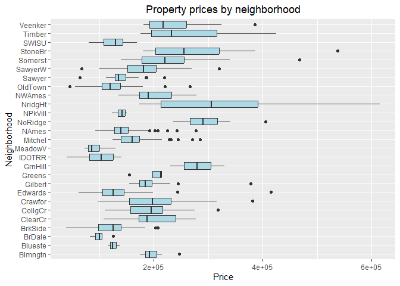<!-- -->

The boxplots confirm what we already found out when we computed the
zoning and price statistics of each neighborhood.

Some of the boxplots should not be trusted because of the very small
number of data points, in particular Green Hills, Bluestem, Greens and
Northpark Villa.

<h3>

7.3 Neighborhood ages statistics
</h3>

Now that we have some understanding of the type of area each
neighborhood name implies, we compute the same statistics for the ages
of properties as we did for prices. Then, we order the neighborhoods by
increasing age.

``` r
stats <- ames_train %>% group_by(Neighborhood) %>%
                            summarise(
                                Properties = n(),
                                Age.Median = median(Age),
                                Age.Sd = sd(Age))

neighborhood_stats <- data.frame(
                            Neighborhood = rownames(zoning),
                            Properties = stats$Properties,
                            Age.Median = round(stats$Age.Median),
                            Age.Sd = round(stats$Age.Sd),
                            RL = zoning$RL,
                            RM = zoning$RM,
                            RH = zoning$RH,
                            FV = zoning$FV,
                            C  = zoning$`C (all)`,
                            I  = zoning$`I (all)`,
                            A  = zoning$`A (agr)`)

colnames(neighborhood_stats) <- 
      c("Neighborhood", "Properties", "Age Median", "Age Sd",
        "Residential Low Density", "Residential Medium Density", "Residential High Density",
        "Floating Village Residential", "Commercial", "Industrial", "Agriculture")

# Order neighborhoods by increasing age median values
neighborhood_stats <- neighborhood_stats[order(neighborhood_stats[,3], decreasing=FALSE),]

formattable(neighborhood_stats, align="c", row.names=FALSE)
```

<table class="table table-condensed">

<thead>

<tr>

<th style="text-align:center;">

Neighborhood
</th>

<th style="text-align:center;">

Properties
</th>

<th style="text-align:center;">

Age Median
</th>

<th style="text-align:center;">

Age Sd
</th>

<th style="text-align:center;">

Residential Low Density
</th>

<th style="text-align:center;">

Residential Medium Density
</th>

<th style="text-align:center;">

Residential High Density
</th>

<th style="text-align:center;">

Floating Village Residential
</th>

<th style="text-align:center;">

Commercial
</th>

<th style="text-align:center;">

Industrial
</th>

<th style="text-align:center;">

Agriculture
</th>

</tr>

</thead>

<tbody>

<tr>

<td style="text-align:center;">

NridgHt
</td>

<td style="text-align:center;">

36
</td>

<td style="text-align:center;">

5
</td>

<td style="text-align:center;">

2
</td>

<td style="text-align:center;">

36
</td>

<td style="text-align:center;">

0
</td>

<td style="text-align:center;">

0
</td>

<td style="text-align:center;">

0
</td>

<td style="text-align:center;">

0
</td>

<td style="text-align:center;">

0
</td>

<td style="text-align:center;">

0
</td>

</tr>

<tr>

<td style="text-align:center;">

Blmngtn
</td>

<td style="text-align:center;">

7
</td>

<td style="text-align:center;">

6
</td>

<td style="text-align:center;">

2
</td>

<td style="text-align:center;">

6
</td>

<td style="text-align:center;">

1
</td>

<td style="text-align:center;">

0
</td>

<td style="text-align:center;">

0
</td>

<td style="text-align:center;">

0
</td>

<td style="text-align:center;">

0
</td>

<td style="text-align:center;">

0
</td>

</tr>

<tr>

<td style="text-align:center;">

Somerst
</td>

<td style="text-align:center;">

45
</td>

<td style="text-align:center;">

6
</td>

<td style="text-align:center;">

3
</td>

<td style="text-align:center;">

10
</td>

<td style="text-align:center;">

0
</td>

<td style="text-align:center;">

0
</td>

<td style="text-align:center;">

35
</td>

<td style="text-align:center;">

0
</td>

<td style="text-align:center;">

0
</td>

<td style="text-align:center;">

0
</td>

</tr>

<tr>

<td style="text-align:center;">

Timber
</td>

<td style="text-align:center;">

17
</td>

<td style="text-align:center;">

8
</td>

<td style="text-align:center;">

15
</td>

<td style="text-align:center;">

17
</td>

<td style="text-align:center;">

0
</td>

<td style="text-align:center;">

0
</td>

<td style="text-align:center;">

0
</td>

<td style="text-align:center;">

0
</td>

<td style="text-align:center;">

0
</td>

<td style="text-align:center;">

0
</td>

</tr>

<tr>

<td style="text-align:center;">

CollgCr
</td>

<td style="text-align:center;">

75
</td>

<td style="text-align:center;">

10
</td>

<td style="text-align:center;">

11
</td>

<td style="text-align:center;">

73
</td>

<td style="text-align:center;">

2
</td>

<td style="text-align:center;">

0
</td>

<td style="text-align:center;">

0
</td>

<td style="text-align:center;">

0
</td>

<td style="text-align:center;">

0
</td>

<td style="text-align:center;">

0
</td>

</tr>

<tr>

<td style="text-align:center;">

Gilbert
</td>

<td style="text-align:center;">

36
</td>

<td style="text-align:center;">

10
</td>

<td style="text-align:center;">

8
</td>

<td style="text-align:center;">

36
</td>

<td style="text-align:center;">

0
</td>

<td style="text-align:center;">

0
</td>

<td style="text-align:center;">

0
</td>

<td style="text-align:center;">

0
</td>

<td style="text-align:center;">

0
</td>

<td style="text-align:center;">

0
</td>

</tr>

<tr>

<td style="text-align:center;">

StoneBr
</td>

<td style="text-align:center;">

12
</td>

<td style="text-align:center;">

10
</td>

<td style="text-align:center;">

8
</td>

<td style="text-align:center;">

12
</td>

<td style="text-align:center;">

0
</td>

<td style="text-align:center;">

0
</td>

<td style="text-align:center;">

0
</td>

<td style="text-align:center;">

0
</td>

<td style="text-align:center;">

0
</td>

<td style="text-align:center;">

0
</td>

</tr>

<tr>

<td style="text-align:center;">

NoRidge
</td>

<td style="text-align:center;">

28
</td>

<td style="text-align:center;">

16
</td>

<td style="text-align:center;">

3
</td>

<td style="text-align:center;">

28
</td>

<td style="text-align:center;">

0
</td>

<td style="text-align:center;">

0
</td>

<td style="text-align:center;">

0
</td>

<td style="text-align:center;">

0
</td>

<td style="text-align:center;">

0
</td>

<td style="text-align:center;">

0
</td>

</tr>

<tr>

<td style="text-align:center;">

SawyerW
</td>

<td style="text-align:center;">

39
</td>

<td style="text-align:center;">

17
</td>

<td style="text-align:center;">

23
</td>

<td style="text-align:center;">

36
</td>

<td style="text-align:center;">

0
</td>

<td style="text-align:center;">

3
</td>

<td style="text-align:center;">

0
</td>

<td style="text-align:center;">

0
</td>

<td style="text-align:center;">

0
</td>

<td style="text-align:center;">

0
</td>

</tr>

<tr>

<td style="text-align:center;">

GrnHill
</td>

<td style="text-align:center;">

2
</td>

<td style="text-align:center;">

18
</td>

<td style="text-align:center;">

8
</td>

<td style="text-align:center;">

0
</td>

<td style="text-align:center;">

2
</td>

<td style="text-align:center;">

0
</td>

<td style="text-align:center;">

0
</td>

<td style="text-align:center;">

0
</td>

<td style="text-align:center;">

0
</td>

<td style="text-align:center;">

0
</td>

</tr>

<tr>

<td style="text-align:center;">

Blueste
</td>

<td style="text-align:center;">

3
</td>

<td style="text-align:center;">

30
</td>

<td style="text-align:center;">

0
</td>

<td style="text-align:center;">

0
</td>

<td style="text-align:center;">

3
</td>

<td style="text-align:center;">

0
</td>

<td style="text-align:center;">

0
</td>

<td style="text-align:center;">

0
</td>

<td style="text-align:center;">

0
</td>

<td style="text-align:center;">

0
</td>

</tr>

<tr>

<td style="text-align:center;">

Greens
</td>

<td style="text-align:center;">

4
</td>

<td style="text-align:center;">

30
</td>

<td style="text-align:center;">

1
</td>

<td style="text-align:center;">

4
</td>

<td style="text-align:center;">

0
</td>

<td style="text-align:center;">

0
</td>

<td style="text-align:center;">

0
</td>

<td style="text-align:center;">

0
</td>

<td style="text-align:center;">

0
</td>

<td style="text-align:center;">

0
</td>

</tr>

<tr>

<td style="text-align:center;">

Mitchel
</td>

<td style="text-align:center;">

41
</td>

<td style="text-align:center;">

32
</td>

<td style="text-align:center;">

14
</td>

<td style="text-align:center;">

36
</td>

<td style="text-align:center;">

5
</td>

<td style="text-align:center;">

0
</td>

<td style="text-align:center;">

0
</td>

<td style="text-align:center;">

0
</td>

<td style="text-align:center;">

0
</td>

<td style="text-align:center;">

0
</td>

</tr>

<tr>

<td style="text-align:center;">

Veenker
</td>

<td style="text-align:center;">

9
</td>

<td style="text-align:center;">

32
</td>

<td style="text-align:center;">

9
</td>

<td style="text-align:center;">

9
</td>

<td style="text-align:center;">

0
</td>

<td style="text-align:center;">

0
</td>

<td style="text-align:center;">

0
</td>

<td style="text-align:center;">

0
</td>

<td style="text-align:center;">

0
</td>

<td style="text-align:center;">

0
</td>

</tr>

<tr>

<td style="text-align:center;">

NWAmes
</td>

<td style="text-align:center;">

35
</td>

<td style="text-align:center;">

33
</td>

<td style="text-align:center;">

7
</td>

<td style="text-align:center;">

35
</td>

<td style="text-align:center;">

0
</td>

<td style="text-align:center;">

0
</td>

<td style="text-align:center;">

0
</td>

<td style="text-align:center;">

0
</td>

<td style="text-align:center;">

0
</td>

<td style="text-align:center;">

0
</td>

</tr>

<tr>

<td style="text-align:center;">

NPkVill
</td>

<td style="text-align:center;">

4
</td>

<td style="text-align:center;">

35
</td>

<td style="text-align:center;">

1
</td>

<td style="text-align:center;">

4
</td>

<td style="text-align:center;">

0
</td>

<td style="text-align:center;">

0
</td>

<td style="text-align:center;">

0
</td>

<td style="text-align:center;">

0
</td>

<td style="text-align:center;">

0
</td>

<td style="text-align:center;">

0
</td>

</tr>

<tr>

<td style="text-align:center;">

BrDale
</td>

<td style="text-align:center;">

7
</td>

<td style="text-align:center;">

38
</td>

<td style="text-align:center;">

1
</td>

<td style="text-align:center;">

0
</td>

<td style="text-align:center;">

7
</td>

<td style="text-align:center;">

0
</td>

<td style="text-align:center;">

0
</td>

<td style="text-align:center;">

0
</td>

<td style="text-align:center;">

0
</td>

<td style="text-align:center;">

0
</td>

</tr>

<tr>

<td style="text-align:center;">

MeadowV
</td>

<td style="text-align:center;">

16
</td>

<td style="text-align:center;">

39
</td>

<td style="text-align:center;">

3
</td>

<td style="text-align:center;">

0
</td>

<td style="text-align:center;">

16
</td>

<td style="text-align:center;">

0
</td>

<td style="text-align:center;">

0
</td>

<td style="text-align:center;">

0
</td>

<td style="text-align:center;">

0
</td>

<td style="text-align:center;">

0
</td>

</tr>

<tr>

<td style="text-align:center;">

ClearCr
</td>

<td style="text-align:center;">

11
</td>

<td style="text-align:center;">

44
</td>

<td style="text-align:center;">

26
</td>

<td style="text-align:center;">

11
</td>

<td style="text-align:center;">

0
</td>

<td style="text-align:center;">

0
</td>

<td style="text-align:center;">

0
</td>

<td style="text-align:center;">

0
</td>

<td style="text-align:center;">

0
</td>

<td style="text-align:center;">

0
</td>

</tr>

<tr>

<td style="text-align:center;">

Sawyer
</td>

<td style="text-align:center;">

57
</td>

<td style="text-align:center;">

45
</td>

<td style="text-align:center;">

11
</td>

<td style="text-align:center;">

56
</td>

<td style="text-align:center;">

1
</td>

<td style="text-align:center;">

0
</td>

<td style="text-align:center;">

0
</td>

<td style="text-align:center;">

0
</td>

<td style="text-align:center;">

0
</td>

<td style="text-align:center;">

0
</td>

</tr>

<tr>

<td style="text-align:center;">

NAmes
</td>

<td style="text-align:center;">

140
</td>

<td style="text-align:center;">

50
</td>

<td style="text-align:center;">

9
</td>

<td style="text-align:center;">

138
</td>

<td style="text-align:center;">

0
</td>

<td style="text-align:center;">

2
</td>

<td style="text-align:center;">

0
</td>

<td style="text-align:center;">

0
</td>

<td style="text-align:center;">

0
</td>

<td style="text-align:center;">

0
</td>

</tr>

<tr>

<td style="text-align:center;">

Edwards
</td>

<td style="text-align:center;">

50
</td>

<td style="text-align:center;">

55
</td>

<td style="text-align:center;">

23
</td>

<td style="text-align:center;">

46
</td>

<td style="text-align:center;">

3
</td>

<td style="text-align:center;">

1
</td>

<td style="text-align:center;">

0
</td>

<td style="text-align:center;">

0
</td>

<td style="text-align:center;">

0
</td>

<td style="text-align:center;">

0
</td>

</tr>

<tr>

<td style="text-align:center;">

Crawfor
</td>

<td style="text-align:center;">

25
</td>

<td style="text-align:center;">

70
</td>

<td style="text-align:center;">

18
</td>

<td style="text-align:center;">

25
</td>

<td style="text-align:center;">

0
</td>

<td style="text-align:center;">

0
</td>

<td style="text-align:center;">

0
</td>

<td style="text-align:center;">

0
</td>

<td style="text-align:center;">

0
</td>

<td style="text-align:center;">

0
</td>

</tr>

<tr>

<td style="text-align:center;">

SWISU
</td>

<td style="text-align:center;">

10
</td>

<td style="text-align:center;">

81
</td>

<td style="text-align:center;">

9
</td>

<td style="text-align:center;">

10
</td>

<td style="text-align:center;">

0
</td>

<td style="text-align:center;">

0
</td>

<td style="text-align:center;">

0
</td>

<td style="text-align:center;">

0
</td>

<td style="text-align:center;">

0
</td>

<td style="text-align:center;">

0
</td>

</tr>

<tr>

<td style="text-align:center;">

BrkSide
</td>

<td style="text-align:center;">

36
</td>

<td style="text-align:center;">

82
</td>

<td style="text-align:center;">

12
</td>

<td style="text-align:center;">

14
</td>

<td style="text-align:center;">

22
</td>

<td style="text-align:center;">

0
</td>

<td style="text-align:center;">

0
</td>

<td style="text-align:center;">

0
</td>

<td style="text-align:center;">

0
</td>

<td style="text-align:center;">

0
</td>

</tr>

<tr>

<td style="text-align:center;">

IDOTRR
</td>

<td style="text-align:center;">

27
</td>

<td style="text-align:center;">

83
</td>

<td style="text-align:center;">

13
</td>

<td style="text-align:center;">

0
</td>

<td style="text-align:center;">

22
</td>

<td style="text-align:center;">

0
</td>

<td style="text-align:center;">

0
</td>

<td style="text-align:center;">

4
</td>

<td style="text-align:center;">

1
</td>

<td style="text-align:center;">

0
</td>

</tr>

<tr>

<td style="text-align:center;">

OldTown
</td>

<td style="text-align:center;">

62
</td>

<td style="text-align:center;">

90
</td>

<td style="text-align:center;">

20
</td>

<td style="text-align:center;">

14
</td>

<td style="text-align:center;">

47
</td>

<td style="text-align:center;">

0
</td>

<td style="text-align:center;">

0
</td>

<td style="text-align:center;">

1
</td>

<td style="text-align:center;">

0
</td>

<td style="text-align:center;">

0
</td>

</tr>

</tbody>

</table>

The most recent neighborhood is Northridge Heights, which is also the
most expensive one. The age median is only 5 years.

Old Town has an age median of 90 years, the highest one. No surprise
given the name of the neighborhood.

Meadow Village, the least expensive one, has an age median of 39. It is
not so old. It was built over a period of 7 years, then construction
stopped.

The most heterogeneous neighborhoods age wise are Sawyer West and
Edwards. These neighborhoods are also heterogeneous price wise.

<h3>

7.4 Neighborhood ages boxplots
</h3>

Next we draw side-by-side boxplots of neighborhood ages.

``` r
ggplot(ames_train, aes(x = Neighborhood, y = Age)) +
    geom_boxplot(fill="lightblue") +
    labs(title = "Property ages by neighborhood", x = "Neighborhood", y = "Age") +
    theme(plot.title = element_text(hjust = 0.5)) +
    coord_flip()
```

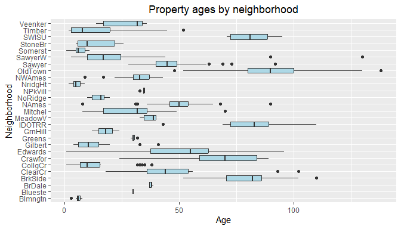<!-- -->

The boxplots show in a visual manner what we already found out when we
computed the age statistics.

Newer properties seem to be more expensive than older ones as you would
expect. We will see later on if we can confirm it when we draw a
scattered plot of Price versus Age.

<h2>

8.  Price variable distribution
    </h2>

Price, our response variable, takes values that range from 39300 to
615000. This is a wide range so we may wonder whether log transforming
the variable could bring some improvements to our model.

We first draw of histogram of Price.

``` r
ggplot(ames_train, aes(x = Price)) + 
    geom_histogram(bins=30, color="black", fill="lightblue") +
    labs(title = "Price variable distribution", x = "Price", y = "Count") +
    theme(plot.title=element_text(hjust = 0.5))
```

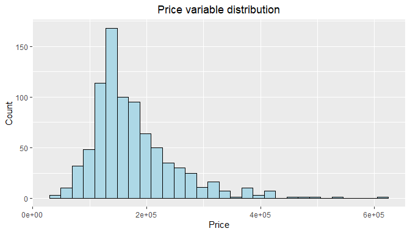<!-- -->

The distribution of Price is right skewed with a long tail towards
higher prices.

Let’s redraw the histogram with log transformed Price and see what we
get.

``` r
ggplot(ames_train, aes(x = log(Price))) +
    geom_histogram(bins=30, color="black", fill="lightblue") +
    labs(title = "Distribution of log transformed Price", x = "log(Price)", y = "Count") +
    theme(plot.title=element_text(hjust = 0.5))
```

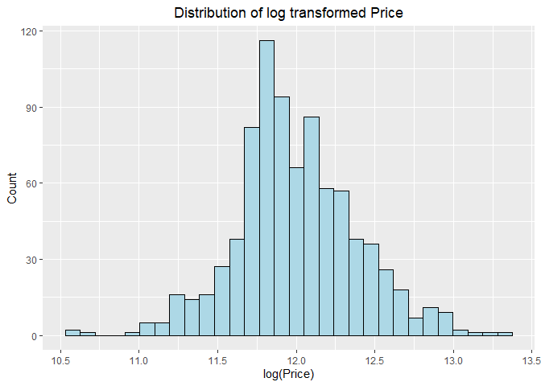<!-- -->

The distribution of log transformed Price is much more symmetrical.
Let’s draw a Q-Q plot to check how close it is to a normal distribution.

``` r
ggplot(ames_train, aes(sample = log(Price))) + stat_qq() + stat_qq_line(color="red") +
    labs(title = "Q-Q plot of log transformed Price") +
    theme(plot.title=element_text(hjust = 0.5))
```

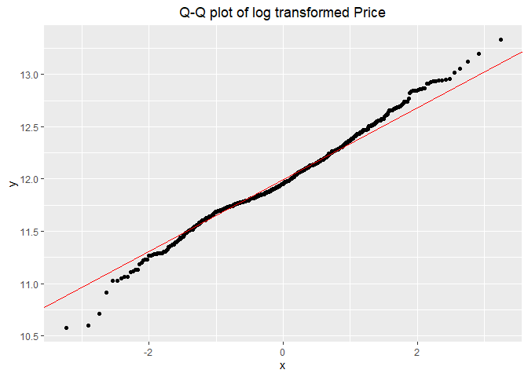<!-- -->

The distribution of log transformed Price is fairly close to normal. A
normal distribution is preferable to a skewed distribution, so we will
log transform Price in our model.

There are 3 outliers at the lower tail. These are properties that sold
for very low prices:
<ul>

<li>

One sold for \$39,300. This is the smallest house in the data set with
only 334 sqft. It has only 1 bedroom and no garage. Overall quality is
“Very Poor”.
</li>

<li>

Another one sold for \$45,000. It is also a small house with only 612
sqft. It is 70 years old and has only 1 bedroom. The garage can
accommodate only 1 car. Overall quality is “Poor” and overall condition
is “Below Average”.
</li>

<li>

The third one sold for \$40,000. It is larger than the two others with
1317 sqft but it is 90 years old. It has 3 bedrooms but only 1 bathroom.
The garage can accomodate only 1 car. Overall quality and condition are
both “Below Average”.
</li>

</ul>

We get rid of these 3 outliers.

``` r
ames_train <- ames_train %>% filter((Price > 45000))
```

<h2>

9.  Correlations between explanatory variables
    </h2>

We suspect that explanatory variables Area, Lot.Area and Age may be
correlated. We should avoid using collinear variables in our model, so
we need to investigate it.

Let’s draw a correlation plot of Area, Lot.Area and Age.

``` r
correlations <- ames_train %>% dplyr::select(Area, Lot.Area, Age)
ggpairs(correlations)
```

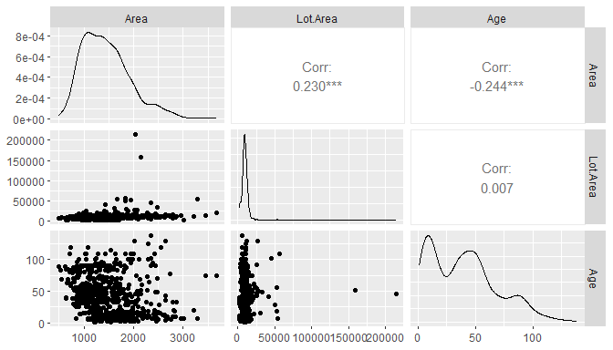<!-- -->

The plot shows some correlation between Area and Lot.Area with a
positive correlation coefficient of 0.23. House area and lot area
increase and decrease together.

There is also some significant correlation between Age and Area with a
negative correlation coefficient of -0.244. Older houses tend to be
smaller than newer ones.

Interestingly, there is virtually no correlation between Lot.Area and
Age.

Although there are some significant correlations, none of the
correlation coefficients are large enough to justify not using all these
variables in our model.

<h2>

10. Scattered plots
    </h2>

In this section, we create scattered plots of Price versus key numerical
explanatory variables, namely Area, Lot.Area and Age. Our goal is to
check that Price is linearly correlated to these variables, identify
outliers and decide what to do with them, and determine whether some of
these variables should be transformed.

We use log transformed Price as we decided to do.

<h3>

10.1 Price versus house area
</h3>

``` r
ggplot(ames_train, aes(x = Area, y = log(Price))) + geom_point() +
    geom_smooth(formula = "y ~ x", method = "lm", se = FALSE, color = "red", size = 0.5) +
    labs(title = "Price versus house area", x = "Area", y = "log(Price)") +
    theme(plot.title = element_text(hjust = 0.5))
```

    ## Warning: Using `size` aesthetic for lines was deprecated in ggplot2 3.4.0.
    ## ℹ Please use `linewidth` instead.
    ## This warning is displayed once per session.
    ## Call `lifecycle::last_lifecycle_warnings()` to see where this warning was
    ## generated.

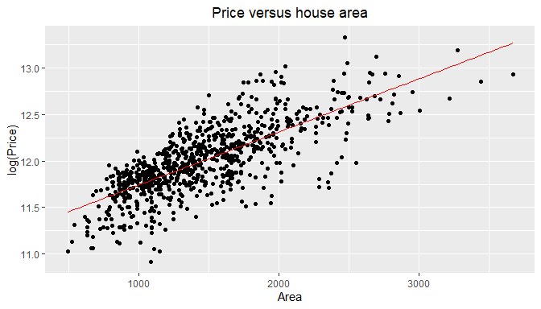<!-- -->

The plot shows an obvious positive linear correlation between Area and
log(Price). Price and Area increase and decrease together.

There are no outliers.

<h3>

10.2 Price versus lot size
</h3>

``` r
ggplot(ames_train, aes(x = Lot.Area, y = log(Price))) + geom_point() +
    geom_smooth(formula = "y ~ x", method = "lm", se = FALSE, color = "red", size = 0.5) +
    labs(title = "Price versus lot area", x = "Lot.Area", y = "log(Price)") +
    theme(plot.title = element_text(hjust = 0.5))
```

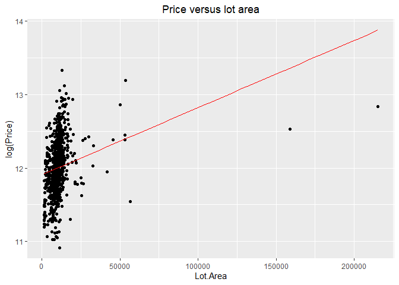<!-- -->

The plot suggests a positive linear correlation between Lot.Area and
log(Price). But instead of being close to vertical, the fitting line is
at an angle of about 25°.

There are 2 outliers towards larger lot areas that are influential
points and drive down the slope of the fitting line. These 2 outliers
are properties that have extremely large lot sizes. The median lot area
is 9,202 sqft and these two properties have lot areas of 215,245 sqft
and 159,000 sqft. Although they have huge lot sizes, they did not sell
for particularly high prices.

We remove these 2 influential points and redraw the scattered plot.

``` r
ames_train <- ames_train %>% filter(Lot.Area < 159000)

ggplot(ames_train, aes(x = Lot.Area, y = log(Price))) + geom_point() +
    geom_smooth(formula = "y ~ x", method = "lm", se = FALSE, color = "red", size = 0.5) +
    labs(title = "Price versus lot area", x = "Lot.Area", y = "log(Price)") +
    theme(plot.title=element_text(hjust = 0.5))
```

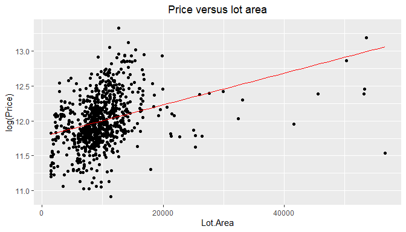<!-- -->

The plot looks better but the angle of the fitting line is still too
low.

There are 24 properties with lot sizes greater than 20,000 sqft that are
influential points and drive down the slope of the fitting line. We
could remove them but 24 is already a large number. Removing too many
outliers from the training data may significantly increase the overfit
of the model.

At this point, Lot.Area still varies from 1,470 to 56,600. This is a
wide range so instead of dropping these outliers, we may be better off
log transforming Lot.Area.

Let’s draw a scattered plot using log transformed Lot.Area instead of
Lot.Area.

``` r
  ggplot(ames_train, aes(x = log(Lot.Area), y = log(Price))) + geom_point() +
    geom_smooth(formula="y ~ x", method = "lm", se = FALSE, color = "red", size = 0.5) +
    labs(title = "Price versus log transformed lot area", x = "log(Lot.Area)", y = "log(Price)") +
    theme(plot.title=element_text(hjust = 0.5))
```

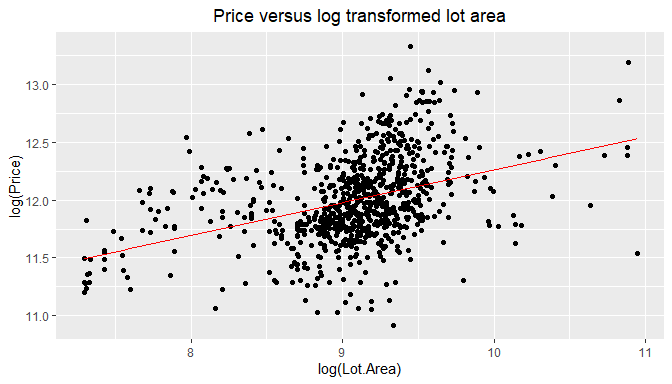<!-- -->

The plot shows a fair positive linear correlation between log(Lot.Area)
and log(Price). There are no obvious outliers.

Therefore, we will use log transformed Lot.Area instead of Lot.Area in
our model.

<h3>

10.3 Price versus house age
</h3>

``` r
ggplot(ames_train, aes(x = Age, y = log(Price))) + geom_point() +
    geom_smooth(formula="y ~ x", method = "lm", se = FALSE, color = "red", size = 0.5) +
    labs(title = "Price versus age", x = "Age", y = "log(Price)") +
    theme(plot.title=element_text(hjust = 0.5))
```

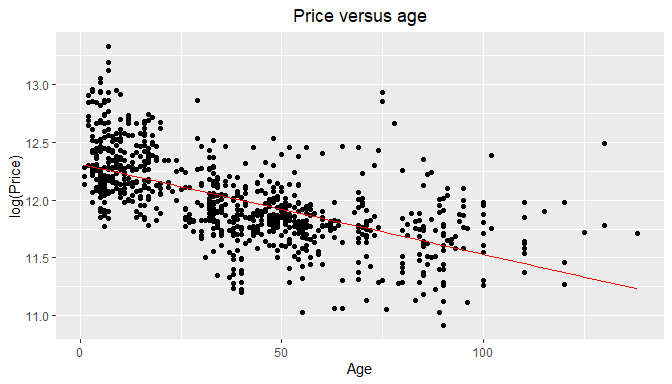<!-- -->

The plot shows a fair linear correlation between Age and log(Price).
Prices go down with age, which confirms what we suspected in the EDA
part.

There are some outliers above the fitting line but they don’t look like
influential points, so we leave them there.

It is interesting to note a surge in prices between 2000 and 2010. For
some reason, many of the properties fetched high prices.

<h2>

11. Linear model development and assessment
    </h2>

Our approach to develop a model is as follows:
<ol>

<li>

We select 10 predictors to create an initial linear model.
</li>

<li>

We enhance the model with more variables to increase the adjusted-R^2.
</li>

<li>

We run AIC and BIC variable selection on the enhanced model to make it
more parsimonious.
</li>

<li>

We select either the AIC-based model or the BIC-based model depending on
the results obtained.
</li>

<li>

We run model diagnostics to check that the chosen model meets the
conditions for a linear regression model to be valid.
</li>

<li>

We calculate the coverage probability and check that it is on target.
</li>

</ol>

<h3>

11.1 Initial model
</h3>

We select the following 10 variables to create our first linear model,
based on our compilation of home search criteria and recommendations
from real estate agents and on our discussion of available variables in
the EDA part:

<ul>

<li>

<b>Area</b> for the size of the house.
<li>

<b>Lot.Area</b> for the size of the lot.
<li>

<b>Age</b> for the age of the house.
<li>

<b>Neighborhood</b> for the location of the property.
<li>

<b>Bldg.Type</b> for the type of building (detached single-family,
townhouse, etc). We avoid using MS.SubClass. As we pointed out earlier,
this variable is somewhat confusing.
</li>

<li>

<b>Bedroom.AbvGr</b> for the number of bedrooms. We don’t add the number
of bathrooms because it is generally proportionate to the number of
bedrooms. Older houses tend to have lower bathroom/bedroom ratios than
more recent houses but this should be captured by Age.
</li>

<li>

<b>Garage.Cars</b> for the number of cars the garage can accommodate.
Most families have at least 2 cars.
</li>

<li>

<b>Overall.Qual</b> for the overall quality of the house.
</li>

<li>

<b>Overall.Cond</b> for the overall condition of the house.
</li>

<li>

<b>Total.Bsmt.SF</b> for the total area of the basement. A basement adds
area to floors and may be used for expansion projects.
</li>

</ul>

Using the training data, we create an initial model with these 10
predictors.

``` r
model.1 <- lm(data = ames_train,
              log(Price) ~ 
                  Area +
                  log(Lot.Area) +
                  Age +
                  Neighborhood +
                  Bldg.Type +
                  Bedroom.AbvGr +
                  Garage.Cars +
                  Overall.Qual +
                  Overall.Cond +
                  Total.Bsmt.SF)

summary(model.1)
```

    ## 
    ## Call:
    ## lm(formula = log(Price) ~ Area + log(Lot.Area) + Age + Neighborhood + 
    ##     Bldg.Type + Bedroom.AbvGr + Garage.Cars + Overall.Qual + 
    ##     Overall.Cond + Total.Bsmt.SF, data = ames_train)
    ## 
    ## Residuals:
    ##      Min       1Q   Median       3Q      Max 
    ## -0.37330 -0.05839  0.00385  0.06100  0.26708 
    ## 
    ## Coefficients:
    ##                       Estimate Std. Error t value Pr(>|t|)    
    ## (Intercept)          1.014e+01  1.478e-01  68.609  < 2e-16 ***
    ## Area                 3.113e-04  1.313e-05  23.718  < 2e-16 ***
    ## log(Lot.Area)        8.742e-02  1.268e-02   6.894 1.12e-11 ***
    ## Age                 -3.790e-03  3.007e-04 -12.606  < 2e-16 ***
    ## NeighborhoodBlueste  4.906e-03  7.022e-02   0.070 0.944320    
    ## NeighborhoodBrDale  -9.220e-02  5.717e-02  -1.613 0.107232    
    ## NeighborhoodBrkSide -2.248e-02  4.787e-02  -0.470 0.638738    
    ## NeighborhoodClearCr  4.489e-02  5.375e-02   0.835 0.403862    
    ## NeighborhoodCollgCr -3.781e-02  4.239e-02  -0.892 0.372705    
    ## NeighborhoodCrawfor  1.041e-01  4.775e-02   2.180 0.029587 *  
    ## NeighborhoodEdwards -8.246e-02  4.458e-02  -1.850 0.064729 .  
    ## NeighborhoodGilbert -3.457e-02  4.486e-02  -0.771 0.441170    
    ## NeighborhoodGreens   1.588e-01  6.265e-02   2.535 0.011454 *  
    ## NeighborhoodGrnHill  4.540e-01  7.940e-02   5.718 1.54e-08 ***
    ## NeighborhoodIDOTRR  -8.833e-02  4.929e-02  -1.792 0.073527 .  
    ## NeighborhoodMeadowV -1.327e-01  4.845e-02  -2.739 0.006300 ** 
    ## NeighborhoodMitchel -4.464e-03  4.425e-02  -0.101 0.919666    
    ## NeighborhoodNAmes   -1.500e-02  4.368e-02  -0.343 0.731398    
    ## NeighborhoodNoRidge  1.610e-02  4.483e-02   0.359 0.719540    
    ## NeighborhoodNPkVill  5.945e-03  6.388e-02   0.093 0.925877    
    ## NeighborhoodNridgHt  4.527e-02  4.295e-02   1.054 0.292229    
    ## NeighborhoodNWAmes  -6.966e-02  4.490e-02  -1.551 0.121206    
    ## NeighborhoodOldTown -7.247e-02  4.756e-02  -1.524 0.128013    
    ## NeighborhoodSawyer  -2.437e-02  4.488e-02  -0.543 0.587266    
    ## NeighborhoodSawyerW -7.488e-02  4.379e-02  -1.710 0.087656 .  
    ## NeighborhoodSomerst  4.222e-02  4.114e-02   1.026 0.305032    
    ## NeighborhoodStoneBr  4.137e-02  4.763e-02   0.869 0.385264    
    ## NeighborhoodSWISU   -3.504e-02  5.461e-02  -0.642 0.521382    
    ## NeighborhoodTimber   3.531e-03  4.747e-02   0.074 0.940728    
    ## NeighborhoodVeenker  3.220e-02  5.216e-02   0.617 0.537233    
    ## Bldg.Type2fmCon     -1.737e-02  2.545e-02  -0.683 0.495076    
    ## Bldg.TypeDuplex     -1.204e-01  2.051e-02  -5.869 6.50e-09 ***
    ## Bldg.TypeTwnhs      -5.390e-02  2.877e-02  -1.873 0.061408 .  
    ## Bldg.TypeTwnhsE     -2.214e-04  1.996e-02  -0.011 0.991152    
    ## Bedroom.AbvGr       -1.755e-02  6.411e-03  -2.737 0.006347 ** 
    ## Garage.Cars          3.720e-02  6.833e-03   5.444 6.98e-08 ***
    ## Overall.Qual3        7.583e-02  7.035e-02   1.078 0.281378    
    ## Overall.Qual4        1.485e-01  6.433e-02   2.309 0.021198 *  
    ## Overall.Qual5        1.976e-01  6.376e-02   3.099 0.002014 ** 
    ## Overall.Qual6        2.541e-01  6.425e-02   3.955 8.34e-05 ***
    ## Overall.Qual7        3.177e-01  6.474e-02   4.907 1.13e-06 ***
    ## Overall.Qual8        3.846e-01  6.626e-02   5.804 9.46e-09 ***
    ## Overall.Qual9        5.283e-01  6.967e-02   7.583 9.68e-14 ***
    ## Overall.Qual10       5.774e-01  8.351e-02   6.915 9.78e-12 ***
    ## Overall.Cond2        2.231e-01  1.252e-01   1.782 0.075180 .  
    ## Overall.Cond3        1.414e-01  8.305e-02   1.703 0.089009 .  
    ## Overall.Cond4        2.868e-01  7.805e-02   3.675 0.000254 ***
    ## Overall.Cond5        3.292e-01  7.707e-02   4.272 2.18e-05 ***
    ## Overall.Cond6        3.790e-01  7.714e-02   4.913 1.10e-06 ***
    ## Overall.Cond7        4.533e-01  7.728e-02   5.866 6.60e-09 ***
    ## Overall.Cond8        4.877e-01  7.806e-02   6.247 6.88e-10 ***
    ## Overall.Cond9        5.260e-01  8.268e-02   6.362 3.40e-10 ***
    ## Total.Bsmt.SF        1.507e-04  1.190e-05  12.664  < 2e-16 ***
    ## ---
    ## Signif. codes:  0 '***' 0.001 '**' 0.01 '*' 0.05 '.' 0.1 ' ' 1
    ## 
    ## Residual standard error: 0.09626 on 776 degrees of freedom
    ## Multiple R-squared:  0.9374, Adjusted R-squared:  0.9332 
    ## F-statistic: 223.5 on 52 and 776 DF,  p-value: < 2.2e-16

Our first model has an adjusted-R^2 of 0.9332.

p-values show that most of the main predictors are significant; some
categorical levels (e.g., certain neighborhoods) are not significant
individually, but they contribute to the overall model.

<h3>

11.2 Enhanced model
</h3>

We now add the following variables to the initial model to incorporate
more information about the property features we selected:
<ul>

<li>

<b>House.Style</b> for more information about the type of building.
<li>

<b>Garage.Type</b>, <b>Garage.Area</b>, <b>Garage.Qual</b> and
<b>Garage.Cond</b> for more information about the garage.
</li>

<li>

<b>Exter.Qual</b> and <b>Exter.Cond</b> for more information about the
quality and condition of the house.
</li>

<li>

<b>BsmtFin.SF.1</b>, <b>BsmtFin.SF.2</b>, <b>Bsmt.Qual</b>,
<b>Bsmt.Cond</b>, <b>Bsmt.Full.Bath</b> and <b>Bsmt.Half.Bath</b> for
more information about the basement. This includes the square footage of
finished areas, the quality and condition, and the absence/presence of
shower and bathroom.
</li>

</ul>

Ames gets warm in summer time and cold in winter time, so we also add
information about the heating system and air conditioning:
<ul>

<li>

<b>Heating</b> and <b>Heating.QC</b> for the type and quality of the
heating system.
</li>

<li>

<b>Central.Air</b> for the absence/presence of air conditioning.
</li>

</ul>

We now have a total of 25 predictors.

``` r
model.2 <- lm(data = ames_train,
              log(Price) ~ 
                  Area +
                  log(Lot.Area) +
                  Age +
                  Neighborhood +
                  Bldg.Type +
                  House.Style +
                  Bedroom.AbvGr +
                  Garage.Cars +
                  Garage.Type +
                  Garage.Area +
                  Overall.Qual +
                  Overall.Cond +
                  Exter.Qual +
                  Exter.Cond +
                  Total.Bsmt.SF +
                  BsmtFin.SF.1 + 
                  BsmtFin.SF.2 + 
                  Bsmt.Qual +
                  Bsmt.Cond +
                  Bsmt.Full.Bath +
                  Bsmt.Half.Bath +
                  Heating +
                  Heating.QC +
                  Central.Air
                )

summary(model.2)
```

    ## 
    ## Call:
    ## lm(formula = log(Price) ~ Area + log(Lot.Area) + Age + Neighborhood + 
    ##     Bldg.Type + House.Style + Bedroom.AbvGr + Garage.Cars + Garage.Type + 
    ##     Garage.Area + Overall.Qual + Overall.Cond + Exter.Qual + 
    ##     Exter.Cond + Total.Bsmt.SF + BsmtFin.SF.1 + BsmtFin.SF.2 + 
    ##     Bsmt.Qual + Bsmt.Cond + Bsmt.Full.Bath + Bsmt.Half.Bath + 
    ##     Heating + Heating.QC + Central.Air, data = ames_train)
    ## 
    ## Residuals:
    ##      Min       1Q   Median       3Q      Max 
    ## -0.31025 -0.04667  0.00167  0.05094  0.35711 
    ## 
    ## Coefficients: (1 not defined because of singularities)
    ##                       Estimate Std. Error t value Pr(>|t|)    
    ## (Intercept)          1.025e+01  1.752e-01  58.501  < 2e-16 ***
    ## Area                 3.024e-04  1.616e-05  18.708  < 2e-16 ***
    ## log(Lot.Area)        8.158e-02  1.214e-02   6.722 3.60e-11 ***
    ## Age                 -2.935e-03  3.211e-04  -9.141  < 2e-16 ***
    ## NeighborhoodBlueste -1.765e-02  6.558e-02  -0.269 0.787859    
    ## NeighborhoodBrDale  -1.373e-01  5.391e-02  -2.546 0.011095 *  
    ## NeighborhoodBrkSide -4.536e-02  4.494e-02  -1.009 0.313167    
    ## NeighborhoodClearCr -1.892e-03  5.001e-02  -0.038 0.969830    
    ## NeighborhoodCollgCr -7.499e-02  3.897e-02  -1.924 0.054722 .  
    ## NeighborhoodCrawfor  6.518e-02  4.433e-02   1.470 0.141957    
    ## NeighborhoodEdwards -1.222e-01  4.125e-02  -2.962 0.003157 ** 
    ## NeighborhoodGilbert -5.767e-02  4.157e-02  -1.387 0.165750    
    ## NeighborhoodGreens   8.220e-02  5.799e-02   1.418 0.156728    
    ## NeighborhoodGrnHill  4.141e-01  7.281e-02   5.688 1.85e-08 ***
    ## NeighborhoodIDOTRR  -1.145e-01  4.647e-02  -2.463 0.014010 *  
    ## NeighborhoodMeadowV -2.002e-01  4.618e-02  -4.336 1.66e-05 ***
    ## NeighborhoodMitchel -6.285e-02  4.127e-02  -1.523 0.128239    
    ## NeighborhoodNAmes   -6.477e-02  4.066e-02  -1.593 0.111607    
    ## NeighborhoodNoRidge -5.395e-02  4.185e-02  -1.289 0.197715    
    ## NeighborhoodNPkVill -2.378e-02  5.951e-02  -0.400 0.689532    
    ## NeighborhoodNridgHt -1.778e-04  3.960e-02  -0.004 0.996419    
    ## NeighborhoodNWAmes  -1.097e-01  4.171e-02  -2.629 0.008730 ** 
    ## NeighborhoodOldTown -8.999e-02  4.442e-02  -2.026 0.043141 *  
    ## NeighborhoodSawyer  -6.591e-02  4.165e-02  -1.583 0.113957    
    ## NeighborhoodSawyerW -1.128e-01  4.030e-02  -2.798 0.005270 ** 
    ## NeighborhoodSomerst  7.664e-03  3.796e-02   0.202 0.840046    
    ## NeighborhoodStoneBr -2.326e-02  4.391e-02  -0.530 0.596421    
    ## NeighborhoodSWISU   -6.167e-02  5.067e-02  -1.217 0.223991    
    ## NeighborhoodTimber  -4.357e-02  4.349e-02  -1.002 0.316853    
    ## NeighborhoodVeenker -2.881e-02  4.870e-02  -0.592 0.554349    
    ## Bldg.Type2fmCon     -3.651e-02  2.539e-02  -1.438 0.150831    
    ## Bldg.TypeDuplex     -9.838e-02  2.121e-02  -4.639 4.14e-06 ***
    ## Bldg.TypeTwnhs      -4.449e-02  2.663e-02  -1.671 0.095205 .  
    ## Bldg.TypeTwnhsE     -2.336e-03  1.907e-02  -0.123 0.902526    
    ## House.Style1.5Unf   -1.818e-02  3.969e-02  -0.458 0.647014    
    ## House.Style1Story    4.147e-03  1.565e-02   0.265 0.791069    
    ## House.Style2.5Unf    6.119e-03  3.348e-02   0.183 0.855034    
    ## House.Style2Story    5.938e-03  1.457e-02   0.407 0.683772    
    ## House.StyleSFoyer    4.173e-02  2.409e-02   1.732 0.083720 .  
    ## House.StyleSLvl      1.497e-02  2.043e-02   0.732 0.464124    
    ## Bedroom.AbvGr       -1.160e-04  6.289e-03  -0.018 0.985291    
    ## Garage.Cars          1.624e-02  1.150e-02   1.413 0.158028    
    ## Garage.TypeAttchd    6.161e-02  3.427e-02   1.798 0.072641 .  
    ## Garage.TypeBasment   6.759e-02  4.862e-02   1.390 0.164918    
    ## Garage.TypeBuiltIn   2.716e-02  3.770e-02   0.720 0.471453    
    ## Garage.TypeCarPort   6.212e-02  9.471e-02   0.656 0.512134    
    ## Garage.TypeDetchd    4.974e-02  3.451e-02   1.441 0.149971    
    ## Garage.TypeNoGarage  7.665e-02  4.166e-02   1.840 0.066155 .  
    ## Garage.Area          7.172e-05  3.802e-05   1.886 0.059628 .  
    ## Overall.Qual3       -7.113e-03  6.763e-02  -0.105 0.916266    
    ## Overall.Qual4        1.192e-01  6.012e-02   1.983 0.047777 *  
    ## Overall.Qual5        1.522e-01  5.959e-02   2.555 0.010826 *  
    ## Overall.Qual6        2.121e-01  6.021e-02   3.523 0.000453 ***
    ## Overall.Qual7        2.683e-01  6.108e-02   4.392 1.29e-05 ***
    ## Overall.Qual8        3.426e-01  6.249e-02   5.483 5.75e-08 ***
    ## Overall.Qual9        4.698e-01  6.867e-02   6.842 1.65e-11 ***
    ## Overall.Qual10       4.955e-01  8.414e-02   5.889 5.90e-09 ***
    ## Overall.Cond2        3.073e-01  1.236e-01   2.487 0.013094 *  
    ## Overall.Cond3        1.609e-01  8.003e-02   2.010 0.044776 *  
    ## Overall.Cond4        2.706e-01  7.555e-02   3.581 0.000364 ***
    ## Overall.Cond5        3.126e-01  7.555e-02   4.138 3.92e-05 ***
    ## Overall.Cond6        3.501e-01  7.559e-02   4.631 4.30e-06 ***
    ## Overall.Cond7        4.125e-01  7.595e-02   5.431 7.62e-08 ***
    ## Overall.Cond8        4.417e-01  7.640e-02   5.781 1.10e-08 ***
    ## Overall.Cond9        4.509e-01  8.148e-02   5.534 4.35e-08 ***
    ## Exter.QualFa        -6.746e-02  5.162e-02  -1.307 0.191667    
    ## Exter.QualGd        -3.527e-02  3.278e-02  -1.076 0.282305    
    ## Exter.QualTA        -6.779e-02  3.465e-02  -1.956 0.050792 .  
    ## Exter.CondFa        -6.847e-02  5.525e-02  -1.239 0.215614    
    ## Exter.CondGd        -4.340e-02  4.816e-02  -0.901 0.367722    
    ## Exter.CondTA        -3.260e-02  4.783e-02  -0.682 0.495673    
    ## Total.Bsmt.SF        8.476e-05  1.891e-05   4.482 8.59e-06 ***
    ## BsmtFin.SF.1         7.149e-05  1.220e-05   5.861 6.94e-09 ***
    ## BsmtFin.SF.2         2.939e-05  2.030e-05   1.448 0.148095    
    ## Bsmt.QualFa         -9.102e-03  3.074e-02  -0.296 0.767272    
    ## Bsmt.QualGd          7.724e-04  1.837e-02   0.042 0.966481    
    ## Bsmt.QualNoBsmt     -7.192e-02  7.508e-02  -0.958 0.338402    
    ## Bsmt.QualPo         -4.391e-02  9.496e-02  -0.462 0.643925    
    ## Bsmt.QualTA          2.807e-03  2.163e-02   0.130 0.896763    
    ## Bsmt.CondFa         -3.970e-02  6.794e-02  -0.584 0.559193    
    ## Bsmt.CondGd         -4.370e-03  6.609e-02  -0.066 0.947296    
    ## Bsmt.CondNoBsmt             NA         NA      NA       NA    
    ## Bsmt.CondPo         -3.165e-02  1.127e-01  -0.281 0.778934    
    ## Bsmt.CondTA         -2.164e-02  6.416e-02  -0.337 0.735935    
    ## Bsmt.Full.Bath       3.565e-02  8.830e-03   4.037 5.98e-05 ***
    ## Bsmt.Half.Bath       7.946e-03  1.439e-02   0.552 0.580994    
    ## HeatingGasW          7.442e-02  4.082e-02   1.823 0.068675 .  
    ## HeatingGrav          3.342e-02  1.023e-01   0.327 0.743881    
    ## HeatingOthW         -2.869e-02  1.011e-01  -0.284 0.776721    
    ## HeatingWall          3.616e-01  1.037e-01   3.486 0.000519 ***
    ## Heating.QCFa        -9.015e-02  2.725e-02  -3.309 0.000984 ***
    ## Heating.QCGd        -1.073e-02  9.903e-03  -1.084 0.278741    
    ## Heating.QCPo        -3.717e-02  9.940e-02  -0.374 0.708545    
    ## Heating.QCTA        -2.927e-02  9.436e-03  -3.102 0.001996 ** 
    ## Central.AirY         6.744e-02  2.023e-02   3.333 0.000902 ***
    ## ---
    ## Signif. codes:  0 '***' 0.001 '**' 0.01 '*' 0.05 '.' 0.1 ' ' 1
    ## 
    ## Residual standard error: 0.08668 on 735 degrees of freedom
    ## Multiple R-squared:  0.9519, Adjusted R-squared:  0.9458 
    ## F-statistic: 156.5 on 93 and 735 DF,  p-value: < 2.2e-16

The enhanced model has an R^2 of 0.9519 and an adjusted-R^2 of 0.9458.
p-values show that 19 of the 25 predictors we included in the model are
statistically significant.

While R^2 is high, the adjusted-R^2 is noticeably lower, reflecting the
penalty for the model’s many predictors.

<h3>

11.3 AIC predictor selection
</h3>

We run AIC variable selection on the enhanced model. We don’t specify a
stepwise search direction, the default being both “forward” and
“backward”.

``` r
model.3 <- stepAIC(model.2, k = 2, trace = FALSE)
summary(model.3)
```

    ## 
    ## Call:
    ## lm(formula = log(Price) ~ Area + log(Lot.Area) + Age + Neighborhood + 
    ##     Bldg.Type + Garage.Area + Overall.Qual + Overall.Cond + Exter.Qual + 
    ##     Total.Bsmt.SF + BsmtFin.SF.1 + BsmtFin.SF.2 + Bsmt.Full.Bath + 
    ##     Heating + Heating.QC + Central.Air, data = ames_train)
    ## 
    ## Residuals:
    ##      Min       1Q   Median       3Q      Max 
    ## -0.30564 -0.04782  0.00076  0.05266  0.34089 
    ## 
    ## Coefficients:
    ##                       Estimate Std. Error t value Pr(>|t|)    
    ## (Intercept)          1.027e+01  1.402e-01  73.224  < 2e-16 ***
    ## Area                 2.961e-04  9.728e-06  30.434  < 2e-16 ***
    ## log(Lot.Area)        7.928e-02  1.167e-02   6.794 2.20e-11 ***
    ## Age                 -3.072e-03  2.930e-04 -10.483  < 2e-16 ***
    ## NeighborhoodBlueste -3.008e-02  6.382e-02  -0.471 0.637598    
    ## NeighborhoodBrDale  -1.498e-01  5.205e-02  -2.878 0.004116 ** 
    ## NeighborhoodBrkSide -5.965e-02  4.339e-02  -1.375 0.169574    
    ## NeighborhoodClearCr  1.367e-04  4.905e-02   0.003 0.997776    
    ## NeighborhoodCollgCr -7.795e-02  3.823e-02  -2.039 0.041767 *  
    ## NeighborhoodCrawfor  5.615e-02  4.343e-02   1.293 0.196361    
    ## NeighborhoodEdwards -1.266e-01  4.030e-02  -3.142 0.001742 ** 
    ## NeighborhoodGilbert -6.256e-02  4.073e-02  -1.536 0.124980    
    ## NeighborhoodGreens   7.294e-02  5.735e-02   1.272 0.203805    
    ## NeighborhoodGrnHill  3.780e-01  7.141e-02   5.293 1.58e-07 ***
    ## NeighborhoodIDOTRR  -1.261e-01  4.477e-02  -2.816 0.004982 ** 
    ## NeighborhoodMeadowV -1.916e-01  4.389e-02  -4.365 1.44e-05 ***
    ## NeighborhoodMitchel -6.093e-02  4.047e-02  -1.506 0.132531    
    ## NeighborhoodNAmes   -6.933e-02  3.971e-02  -1.746 0.081229 .  
    ## NeighborhoodNoRidge -5.194e-02  4.089e-02  -1.270 0.204362    
    ## NeighborhoodNPkVill -1.932e-02  5.846e-02  -0.330 0.741150    
    ## NeighborhoodNridgHt -1.153e-02  3.881e-02  -0.297 0.766547    
    ## NeighborhoodNWAmes  -1.081e-01  4.102e-02  -2.634 0.008598 ** 
    ## NeighborhoodOldTown -9.733e-02  4.312e-02  -2.257 0.024278 *  
    ## NeighborhoodSawyer  -7.063e-02  4.086e-02  -1.729 0.084269 .  
    ## NeighborhoodSawyerW -1.164e-01  3.958e-02  -2.941 0.003374 ** 
    ## NeighborhoodSomerst  2.926e-03  3.712e-02   0.079 0.937186    
    ## NeighborhoodStoneBr -3.159e-02  4.342e-02  -0.728 0.467120    
    ## NeighborhoodSWISU   -7.423e-02  4.951e-02  -1.499 0.134188    
    ## NeighborhoodTimber  -4.706e-02  4.294e-02  -1.096 0.273444    
    ## NeighborhoodVeenker -3.005e-02  4.750e-02  -0.633 0.527104    
    ## Bldg.Type2fmCon     -3.973e-02  2.372e-02  -1.675 0.094328 .  
    ## Bldg.TypeDuplex     -9.949e-02  1.921e-02  -5.180 2.85e-07 ***
    ## Bldg.TypeTwnhs      -4.908e-02  2.569e-02  -1.910 0.056476 .  
    ## Bldg.TypeTwnhsE     -1.844e-03  1.772e-02  -0.104 0.917171    
    ## Garage.Area          9.647e-05  2.132e-05   4.525 7.02e-06 ***
    ## Overall.Qual3        2.675e-02  6.440e-02   0.415 0.678055    
    ## Overall.Qual4        1.442e-01  5.795e-02   2.488 0.013051 *  
    ## Overall.Qual5        1.792e-01  5.732e-02   3.126 0.001841 ** 
    ## Overall.Qual6        2.460e-01  5.784e-02   4.254 2.37e-05 ***
    ## Overall.Qual7        3.030e-01  5.852e-02   5.178 2.87e-07 ***
    ## Overall.Qual8        3.768e-01  6.018e-02   6.261 6.37e-10 ***
    ## Overall.Qual9        5.016e-01  6.539e-02   7.672 5.19e-14 ***
    ## Overall.Qual10       5.335e-01  8.099e-02   6.588 8.31e-11 ***
    ## Overall.Cond2        3.021e-01  1.173e-01   2.574 0.010234 *  
    ## Overall.Cond3        1.443e-01  7.571e-02   1.906 0.057087 .  
    ## Overall.Cond4        2.633e-01  7.139e-02   3.688 0.000242 ***
    ## Overall.Cond5        3.071e-01  7.129e-02   4.308 1.86e-05 ***
    ## Overall.Cond6        3.454e-01  7.138e-02   4.839 1.58e-06 ***
    ## Overall.Cond7        4.085e-01  7.146e-02   5.717 1.56e-08 ***
    ## Overall.Cond8        4.356e-01  7.228e-02   6.027 2.60e-09 ***
    ## Overall.Cond9        4.506e-01  7.613e-02   5.919 4.90e-09 ***
    ## Exter.QualFa        -6.988e-02  5.045e-02  -1.385 0.166432    
    ## Exter.QualGd        -3.770e-02  3.253e-02  -1.159 0.246931    
    ## Exter.QualTA        -6.728e-02  3.426e-02  -1.964 0.049951 *  
    ## Total.Bsmt.SF        9.634e-05  1.195e-05   8.062 2.91e-15 ***
    ## BsmtFin.SF.1         7.497e-05  1.146e-05   6.540 1.12e-10 ***
    ## BsmtFin.SF.2         3.433e-05  1.969e-05   1.744 0.081574 .  
    ## Bsmt.Full.Bath       3.750e-02  8.151e-03   4.601 4.93e-06 ***
    ## HeatingGasW          8.123e-02  3.900e-02   2.083 0.037603 *  
    ## HeatingGrav          2.130e-02  9.358e-02   0.228 0.819987    
    ## HeatingOthW         -2.340e-02  9.504e-02  -0.246 0.805602    
    ## HeatingWall          3.282e-01  1.005e-01   3.266 0.001141 ** 
    ## Heating.QCFa        -8.955e-02  2.657e-02  -3.370 0.000789 ***
    ## Heating.QCGd        -9.248e-03  9.663e-03  -0.957 0.338812    
    ## Heating.QCPo        -3.810e-02  9.106e-02  -0.418 0.675808    
    ## Heating.QCTA        -2.797e-02  9.076e-03  -3.082 0.002133 ** 
    ## Central.AirY         7.282e-02  1.905e-02   3.823 0.000142 ***
    ## ---
    ## Signif. codes:  0 '***' 0.001 '**' 0.01 '*' 0.05 '.' 0.1 ' ' 1
    ## 
    ## Residual standard error: 0.08657 on 762 degrees of freedom
    ## Multiple R-squared:  0.9503, Adjusted R-squared:  0.946 
    ## F-statistic: 220.7 on 66 and 762 DF,  p-value: < 2.2e-16

The AIC-based model (AIC model, for short) has 16 predictors.

The adjusted-R^2 is 0.946. The enhanced model had an adjusted-R^2 of
0.9458, so this is approximately the same value.

<h3>

11.4 BIC predictor selection
</h3>

We run BIC variable selection on the enhanced model. Like for AIC
reduction, we don’t specify a stepwise search direction.

``` r
model.4 <- stepAIC(model.2, k = log(nrow(ames_train)), trace = FALSE)
summary(model.4)
```

    ## 
    ## Call:
    ## lm(formula = log(Price) ~ Area + log(Lot.Area) + Age + Neighborhood + 
    ##     Bldg.Type + Garage.Cars + Overall.Qual + Overall.Cond + Total.Bsmt.SF + 
    ##     BsmtFin.SF.1 + Bsmt.Full.Bath + Central.Air, data = ames_train)
    ## 
    ## Residuals:
    ##      Min       1Q   Median       3Q      Max 
    ## -0.31597 -0.05058  0.00221  0.05336  0.32587 
    ## 
    ## Coefficients:
    ##                       Estimate Std. Error t value Pr(>|t|)    
    ## (Intercept)          1.014e+01  1.353e-01  74.955  < 2e-16 ***
    ## Area                 3.006e-04  9.829e-06  30.579  < 2e-16 ***
    ## log(Lot.Area)        8.243e-02  1.169e-02   7.052 3.92e-12 ***
    ## Age                 -3.327e-03  2.816e-04 -11.816  < 2e-16 ***
    ## NeighborhoodBlueste -5.374e-02  6.466e-02  -0.831 0.406156    
    ## NeighborhoodBrDale  -1.562e-01  5.269e-02  -2.965 0.003121 ** 
    ## NeighborhoodBrkSide -5.529e-02  4.406e-02  -1.255 0.209884    
    ## NeighborhoodClearCr  2.524e-03  4.954e-02   0.051 0.959381    
    ## NeighborhoodCollgCr -6.523e-02  3.899e-02  -1.673 0.094709 .  
    ## NeighborhoodCrawfor  5.582e-02  4.405e-02   1.267 0.205413    
    ## NeighborhoodEdwards -1.228e-01  4.107e-02  -2.989 0.002883 ** 
    ## NeighborhoodGilbert -6.356e-02  4.129e-02  -1.539 0.124152    
    ## NeighborhoodGreens   7.067e-02  5.801e-02   1.218 0.223494    
    ## NeighborhoodGrnHill  4.026e-01  7.304e-02   5.511 4.86e-08 ***
    ## NeighborhoodIDOTRR  -1.163e-01  4.534e-02  -2.565 0.010490 *  
    ## NeighborhoodMeadowV -2.027e-01  4.451e-02  -4.555 6.10e-06 ***
    ## NeighborhoodMitchel -6.836e-02  4.100e-02  -1.668 0.095815 .  
    ## NeighborhoodNAmes   -7.079e-02  4.036e-02  -1.754 0.079791 .  
    ## NeighborhoodNoRidge -3.874e-02  4.147e-02  -0.934 0.350531    
    ## NeighborhoodNPkVill -3.952e-02  5.878e-02  -0.672 0.501616    
    ## NeighborhoodNridgHt  4.904e-03  3.962e-02   0.124 0.901533    
    ## NeighborhoodNWAmes  -1.262e-01  4.147e-02  -3.043 0.002419 ** 
    ## NeighborhoodOldTown -9.739e-02  4.374e-02  -2.227 0.026254 *  
    ## NeighborhoodSawyer  -8.088e-02  4.142e-02  -1.953 0.051220 .  
    ## NeighborhoodSawyerW -1.098e-01  4.034e-02  -2.721 0.006654 ** 
    ## NeighborhoodSomerst  1.527e-02  3.785e-02   0.403 0.686761    
    ## NeighborhoodStoneBr -2.437e-02  4.410e-02  -0.553 0.580676    
    ## NeighborhoodSWISU   -8.290e-02  5.033e-02  -1.647 0.099908 .  
    ## NeighborhoodTimber  -4.100e-02  4.379e-02  -0.936 0.349416    
    ## NeighborhoodVeenker -2.523e-02  4.811e-02  -0.524 0.600124    
    ## Bldg.Type2fmCon     -3.320e-02  2.381e-02  -1.395 0.163554    
    ## Bldg.TypeDuplex     -1.096e-01  1.907e-02  -5.743 1.33e-08 ***
    ## Bldg.TypeTwnhs      -4.425e-02  2.603e-02  -1.700 0.089578 .  
    ## Bldg.TypeTwnhsE      5.051e-03  1.783e-02   0.283 0.776987    
    ## Garage.Cars          3.045e-02  6.320e-03   4.818 1.75e-06 ***
    ## Overall.Qual3        7.877e-02  6.462e-02   1.219 0.223249    
    ## Overall.Qual4        1.517e-01  5.895e-02   2.573 0.010278 *  
    ## Overall.Qual5        1.935e-01  5.830e-02   3.319 0.000945 ***
    ## Overall.Qual6        2.562e-01  5.877e-02   4.358 1.49e-05 ***
    ## Overall.Qual7        3.216e-01  5.936e-02   5.418 8.05e-08 ***
    ## Overall.Qual8        3.993e-01  6.084e-02   6.563 9.67e-11 ***
    ## Overall.Qual9        5.397e-01  6.403e-02   8.429  < 2e-16 ***
    ## Overall.Qual10       5.879e-01  7.676e-02   7.659 5.60e-14 ***
    ## Overall.Cond2        2.659e-01  1.153e-01   2.307 0.021314 *  
    ## Overall.Cond3        1.414e-01  7.621e-02   1.855 0.063910 .  
    ## Overall.Cond4        2.758e-01  7.173e-02   3.845 0.000130 ***
    ## Overall.Cond5        3.047e-01  7.092e-02   4.297 1.95e-05 ***
    ## Overall.Cond6        3.492e-01  7.106e-02   4.914 1.09e-06 ***
    ## Overall.Cond7        4.172e-01  7.121e-02   5.859 6.90e-09 ***
    ## Overall.Cond8        4.434e-01  7.210e-02   6.150 1.24e-09 ***
    ## Overall.Cond9        4.762e-01  7.638e-02   6.234 7.45e-10 ***
    ## Total.Bsmt.SF        1.035e-04  1.175e-05   8.806  < 2e-16 ***
    ## BsmtFin.SF.1         6.864e-05  1.100e-05   6.240 7.21e-10 ***
    ## Bsmt.Full.Bath       4.046e-02  7.976e-03   5.073 4.89e-07 ***
    ## Central.AirY         7.476e-02  1.731e-02   4.319 1.77e-05 ***
    ## ---
    ## Signif. codes:  0 '***' 0.001 '**' 0.01 '*' 0.05 '.' 0.1 ' ' 1
    ## 
    ## Residual standard error: 0.08842 on 774 degrees of freedom
    ## Multiple R-squared:  0.9473, Adjusted R-squared:  0.9437 
    ## F-statistic: 257.8 on 54 and 774 DF,  p-value: < 2.2e-16

The AIC model that we created previously had an adjusted-R^2 is 0.946.
The BIC model has an adjusted R^2 of 0.9437.

With its more stringent penalty on model complexity, the BIC model
selected a more parsimonious set of predictors (12 compared to the AIC
model’s 16). While its adjusted R^2 is slightly lower, this is the
expected trade-off for a simpler model. The choice between the two
depends on whether the goal is to maximize predictive power (favoring
the AIC model) or to favor a simpler, more interpretable model (favoring
the BIC model).

<h3>

11.5 Model selection
</h3>

The table below summarizes the results we obtained with the different
models we created.

<table style="text-align:center;">

<tr>

<th>

Model
</th>

<th>

Predictors
</th>

<th>

R^2
</th>

<th>

Adjusted R^2
</th>

</tr>

<tr>

<td>

model.1 (initial model)
</td>

<td>

10
</td>

<td>

0.9374
</td>

<td>

0.9332
</td>

</tr>

<tr>

<td>

model.2 (enhanced model)
</td>

<td>

25
</td>

<td>

0.9519
</td>

<td>

0.9458
</td>

</tr>

<tr>

<td>

model.3 (AIC)
</td>

<td>

16
</td>

<td>

0.9503
</td>

<td>

0.946
</td>

</tr>

<tr>

<td>

model.4 (BIC)
</td>

<td>

12
</td>

<td>

0.9473
</td>

<td>

0.9437
</td>

</tr>

</table>

<br>

The BIC model has an adjusted-R^2 that is slightly lower than the AIC
model but it is more parsimonious. Therefore, we decide to focus on the
BIC model for the rest of the project.

<h3>

11.6 Model interpretation
</h3>

The BIC model has the following predictors:

<pre>
    Area
    log(Lot.Area)
    Age
    Neighborhood  
    Bldg.Type
    Garage.Cars
    Overall.Qual
    Overall.Cond 
    Total.Bsmt.SF
    BsmtFin.SF.1
    Bsmt.Full.Bath
    Central.Air
</pre>

Out of the 10 predictors we included in the initial model, 9 are still
present in the BIC model. Bedroom.AbvGr is the only one that got
removed. This makes sense because type of building and house area
probably provide enough information to infer the number of bedrooms.

Basements are definitely important. Initially, we only included
Total.Bsmt.SF which is the total basement area. After enhancing the
model and running BIC reduction, we also have BsmtFin.SF1 which is the
square footage of the finished basement area. Interestingly, we also
have Bsmt.Full.Bath which indicates the absence/presence of a bathroom
in the basement.

We included in the enhanced model the two variables that describe the
type and quality of the heating system, Heating and Heating.QC. They did
not make it to the BIC model. Type of building and age (more recent
houses have more efficient heating systems than older ones) are probably
enough information to determine the type of heating system.

It is not surprising that Central.Air made it to the BIC model. Out of
the 829 houses that we now have in the training data, only 42 don’t have
air conditioning. Not having it is a major disadvantage.

<h3>

11.7 Model diagnostics
</h3>

We already verified that log(Price) is linearly correlated to Area,
log(Lot.Area) and Age.

We also have to check that the BIC model meets the following conditions
for a linear regression model to be valid:
<ol>

<li>

Residuals must be normally distributed.
</li>

<li>

Residuals must have constant variability.
</li>

</ol>

We draw a Q-Q plot of the residuals to check the first condition.

``` r
residuals <- data.frame(resid = resid(model.4), fitted = fitted(model.4))

ggplot(residuals, aes(sample = resid)) + stat_qq() + stat_qq_line(color="red") +
    labs(title = "Q-Q plot of residuals") +
    theme(plot.title = element_text(hjust = 0.5))
```

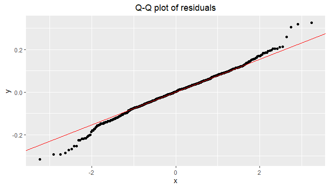<!-- -->

The normal distribution of residuals condition is fairly met. There are
some outliers at the lower and upper tails.

We draw a residuals versus fitted values scattered plot to check the
constant variability of residuals.

``` r
ggplot(residuals, aes(x = fitted, y = resid)) + geom_point() +
    geom_hline(yintercept = 0, color = "red") +
    labs(title = "Residuals versus fitted values", x = "Fitted values", y = "Residuals") +
    theme(plot.title = element_text(hjust = 0.5))
```

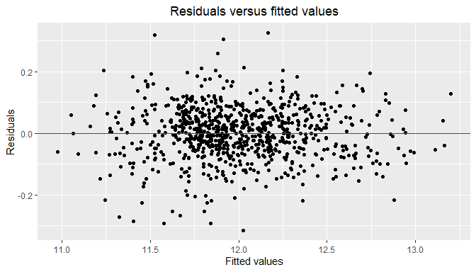<!-- -->

Residuals are randomly distributed in a band centered at 0 (no fan
shape), so the constant variability of residuals condition is met.

The outliers we saw on the Q-Q plot stand out on this plot as well.

<h3>

11.8 Coverage probability
</h3>

We calculate the coverage probability of the BIC model to assess how
well it reflects uncertainty. If assumptions are met, a 95% prediction
interval for Price should include the true value of Price roughly 95% of
the time.

``` r
predict.CI <- exp(predict(model.4, ames_train, interval = "prediction"))
covprob <- mean(ames_train$Price > predict.CI[,"lwr"] & ames_train$Price < predict.CI[,"upr"])

cat(sprintf("model.4 (BIC) coverage probability: %.3f\n", covprob))
```

    ## model.4 (BIC) coverage probability: 0.957

The coverage probability of the model is on target.

<h2>

12. Test set overfit and model tuning
    </h2>

We now use the test set to test our model on some data that has not been
seen yet. Overfitting of the training set is our concern.

<h3>

12.1 Data set preparation
</h3>

Before using the test set, we first have to apply to it the same
transformations as we did to the training set.

``` r
load("ames_test.Rdata")

ames_test$Overall.Qual  <- as.factor(ames_test$Overall.Qual)
ames_test$Overall.Cond  <- as.factor(ames_test$Overall.Cond)

ames_test <- ames_test %>% dplyr::rename(Price = price, Area = area)

ames_test <- mutate(ames_test, Age = 2010 - Year.Built)

ames_test <- ames_test %>% filter(Sale.Condition == "Normal")

ames_test$Garage.Type <- as.factor(ifelse(is.na(ames_test$Garage.Type), "NoGarage", 
                                            as.character(ames_test$Garage.Type)))

ames_test$Garage.Finish <- as.factor(ifelse(is.na(ames_test$Garage.Finish), "NoGarage", 
                                            as.character(ames_test$Garage.Finish)))

ames_test$Garage.Qual <- as.factor(ifelse(is.na(ames_test$Garage.Qual), "NoGarage",
                                            as.character(ames_test$Garage.Qual)))

ames_test$Garage.Cond <- as.factor(ifelse(is.na(ames_test$Garage.Cond), "NoGarage",
                                            as.character(ames_test$Garage.Cond)))

ames_test$Bsmt.Qual <- as.factor(ifelse(is.na(ames_test$Bsmt.Qual), "NoBsmt", 
                                            as.character(ames_test$Bsmt.Qual)))

ames_test$Bsmt.Cond <- as.factor(ifelse(is.na(ames_test$Bsmt.Cond), "NoBsmt", 
                                            as.character(ames_test$Bsmt.Cond)))

ames_test$Bsmt.Exposure <- as.factor(ifelse(is.na(ames_test$Bsmt.Exposure), "NoBsmt",
                                            as.character(ames_test$Bsmt.Exposure)))

ames_test$BsmtFin.Type.1 <- as.factor(ifelse(is.na(ames_test$BsmtFin.Type.1), "NoBsmt",
                                             as.character(ames_test$BsmtFin.Type.1)))

ames_test$BsmtFin.Type.2 <- as.factor(ifelse(is.na(ames_test$BsmtFin.Type.2), "NoBsmt",
                                             as.character(ames_test$BsmtFin.Type.2)))

ames_test$Alley <- as.factor(ifelse(is.na(ames_test$Alley), "NoAlley", 
                                            as.character(ames_test$Alley)))

ames_test$Fireplace.Qu <- as.factor(ifelse(is.na(ames_test$Fireplace.Qu), "NoFireplace",
                                            as.character(ames_test$Fireplace.Qu)))

ames_test$Pool.QC <- as.factor(ifelse(is.na(ames_test$Pool.QC), "NoPool", 
                                            as.character(ames_test$Pool.QC)))

ames_test$Fence <- as.factor(ifelse(is.na(ames_test$Fence), "NoFence", 
                                            as.character(ames_test$Fence)))

ames_test$Misc.Feature <- as.factor(ifelse(is.na(ames_test$Misc.Feature), "NoMiscFea", 
                                            as.character(ames_test$Misc.Feature)))
```

Variable Neighborhood takes the value “Landmrk” in the test set. This
value was not present in the training set, so we have to remove it from
the test set otherwise we will get prediction errors.

The same thing happens with variable Overall.Qual that takes the value 1
in the test set, a value that was not present in the training set.

``` r
ames_test <- ames_test %>% filter((Neighborhood != "Landmrk") & (Overall.Qual != 1))
cat(sprintf("Data points in test set: %d\n", nrow(ames_test)))
```

    ## Data points in test set: 815

<h3>

12.2 Overfit
</h3>

To evaluate the overfit of our model, we compute and compare the RMSE on
the training set and the RMSE on the test set.

``` r
predicted.train <- exp(predict(model.4, ames_train))
residuals.train <- ames_train$Price - predicted.train
RMSE.train <- sqrt(mean(residuals.train^2))

predicted.test <- exp(predict(model.4, ames_test))
residuals.test <- ames_test$Price - predicted.test
RMSE.test <- sqrt(mean(residuals.test^2))

cat(sprintf("model.4 (BIC):\n"),
    sprintf("- Training set RMSE  %d\n", round(RMSE.train)),
    sprintf("- Test set RMSE      %d\n", round(RMSE.test)))
```

    ## model.4 (BIC):
    ##  - Training set RMSE  15693
    ##  - Test set RMSE      16871

The model’s training RMSE is 15693, while its test RMSE is 16871.

The fact that the test RMSE is only slightly higher than the training
RMSE indicates that the model is generalizing well and does not
significantly overfits the training data. This small gap suggests the
model is robust and can be used to make reliable predictions on new
data.

<h3>

12.3 Model tuning to reduce overfit
</h3>

Let’s try to tune the BIC model to reduce the overfit without
significantly degrading adjusted-R^2.

Neighborhood names implicitly convey a lot of highly specific location
information, so we suspect that using Neighborhood in the model may be
responsible for some of the overfit. In the EDA section, we used
MS.Zoning to get some understanding of the type of neighborhood each
name implies. If we replace Neighborhood by MS.Zoning in the model and
add Condition.1 on top of it, we will get something that is not as
location specific as the neighborhood names but that still conveys some
location specific information. We should then have a model that
generalizes better.

In order to try this idea, we write a model that uses the same
predictors as the BIC model but we remove Neighborhood and add MS.Zoning
and Condition.1.

``` r
model.5 <- lm(data = ames_train,
              log(Price) ~ 
                  Area +
                  log(Lot.Area) +
                  Age +
                  MS.Zoning +
                  Condition.1 +
                  Bldg.Type +
                  Garage.Cars +
                  Overall.Qual +
                  Overall.Cond + 
                  Total.Bsmt.SF +
                  BsmtFin.SF.1 +
                  Bsmt.Full.Bath +
                  Central.Air)

summary(model.5)
```

    ## 
    ## Call:
    ## lm(formula = log(Price) ~ Area + log(Lot.Area) + Age + MS.Zoning + 
    ##     Condition.1 + Bldg.Type + Garage.Cars + Overall.Qual + Overall.Cond + 
    ##     Total.Bsmt.SF + BsmtFin.SF.1 + Bsmt.Full.Bath + Central.Air, 
    ##     data = ames_train)
    ## 
    ## Residuals:
    ##      Min       1Q   Median       3Q      Max 
    ## -0.35477 -0.05198  0.00130  0.05822  0.48146 
    ## 
    ## Coefficients:
    ##                    Estimate Std. Error t value Pr(>|t|)    
    ## (Intercept)       9.619e+00  1.512e-01  63.609  < 2e-16 ***
    ## Area              2.885e-04  9.825e-06  29.360  < 2e-16 ***
    ## log(Lot.Area)     9.851e-02  1.146e-02   8.592  < 2e-16 ***
    ## Age              -2.728e-03  1.996e-04 -13.665  < 2e-16 ***
    ## MS.ZoningFV       2.100e-01  5.337e-02   3.934 9.08e-05 ***
    ## MS.ZoningI (all)  2.081e-01  1.631e-01   1.276 0.202255    
    ## MS.ZoningRH       4.226e-02  6.319e-02   0.669 0.503810    
    ## MS.ZoningRL       1.391e-01  5.039e-02   2.761 0.005904 ** 
    ## MS.ZoningRM       9.091e-02  5.049e-02   1.801 0.072143 .  
    ## Condition.1Feedr  2.601e-02  2.698e-02   0.964 0.335227    
    ## Condition.1Norm   7.149e-02  2.332e-02   3.066 0.002244 ** 
    ## Condition.1PosA   7.670e-02  4.327e-02   1.772 0.076701 .  
    ## Condition.1PosN   5.380e-02  3.946e-02   1.363 0.173150    
    ## Condition.1RRAe   2.747e-02  4.122e-02   0.667 0.505267    
    ## Condition.1RRAn   4.223e-02  3.921e-02   1.077 0.281871    
    ## Condition.1RRNe  -4.542e-02  7.127e-02  -0.637 0.524177    
    ## Condition.1RRNn  -4.569e-02  7.181e-02  -0.636 0.524746    
    ## Bldg.Type2fmCon  -1.979e-02  2.501e-02  -0.791 0.429095    
    ## Bldg.TypeDuplex  -1.074e-01  2.015e-02  -5.329 1.29e-07 ***
    ## Bldg.TypeTwnhs   -1.930e-02  2.340e-02  -0.825 0.409555    
    ## Bldg.TypeTwnhsE   4.398e-02  1.572e-02   2.798 0.005273 ** 
    ## Garage.Cars       3.639e-02  6.585e-03   5.526 4.46e-08 ***
    ## Overall.Qual3     5.012e-02  7.624e-02   0.657 0.511172    
    ## Overall.Qual4     1.087e-01  7.009e-02   1.550 0.121426    
    ## Overall.Qual5     1.771e-01  6.964e-02   2.543 0.011174 *  
    ## Overall.Qual6     2.470e-01  7.009e-02   3.525 0.000449 ***
    ## Overall.Qual7     3.307e-01  7.074e-02   4.675 3.46e-06 ***
    ## Overall.Qual8     4.337e-01  7.204e-02   6.021 2.66e-09 ***
    ## Overall.Qual9     5.842e-01  7.475e-02   7.815 1.76e-14 ***
    ## Overall.Qual10    6.440e-01  8.699e-02   7.403 3.43e-13 ***
    ## Overall.Cond2     3.199e-01  1.356e-01   2.360 0.018512 *  
    ## Overall.Cond3     2.268e-01  1.219e-01   1.861 0.063128 .  
    ## Overall.Cond4     3.724e-01  1.185e-01   3.143 0.001737 ** 
    ## Overall.Cond5     4.224e-01  1.187e-01   3.558 0.000396 ***
    ## Overall.Cond6     4.560e-01  1.191e-01   3.827 0.000140 ***
    ## Overall.Cond7     5.324e-01  1.193e-01   4.461 9.33e-06 ***
    ## Overall.Cond8     5.574e-01  1.201e-01   4.640 4.07e-06 ***
    ## Overall.Cond9     5.921e-01  1.237e-01   4.787 2.02e-06 ***
    ## Total.Bsmt.SF     1.015e-04  1.224e-05   8.292 4.80e-16 ***
    ## BsmtFin.SF.1      7.449e-05  1.161e-05   6.416 2.41e-10 ***
    ## Bsmt.Full.Bath    4.008e-02  8.470e-03   4.733 2.63e-06 ***
    ## Central.AirY      5.307e-02  1.870e-02   2.837 0.004667 ** 
    ## ---
    ## Signif. codes:  0 '***' 0.001 '**' 0.01 '*' 0.05 '.' 0.1 ' ' 1
    ## 
    ## Residual standard error: 0.09486 on 787 degrees of freedom
    ## Multiple R-squared:  0.9384, Adjusted R-squared:  0.9351 
    ## F-statistic: 292.2 on 41 and 787 DF,  p-value: < 2.2e-16

Let’s compute the training set RMSE and test set RMSE of this new model.

``` r
predicted.train <- exp(predict(model.5, ames_train))
residuals.train <- ames_train$Price - predicted.train
RMSE.train <- sqrt(mean(residuals.train^2))

predicted.test <- exp(predict(model.5, ames_test))
residuals.test <- ames_test$Price - predicted.test
RMSE.test <- sqrt(mean(residuals.test^2))

cat(sprintf("model.5 (BIC tuned to reduce overfit):\n"),
    sprintf("- Training set RMSE  %d\n", round(RMSE.train)),
    sprintf("- Test set RMSE      %d\n", round(RMSE.test)))
```

    ## model.5 (BIC tuned to reduce overfit):
    ##  - Training set RMSE  17282
    ##  - Test set RMSE      18159

Before tuning, the model had a training RMSE is 15693, while its test
RMSE was 16871.

The tuned model has a training RMSE of 17282 and a test RMSE of 18159,
indicating that it generalizes better.

The adjusted-R^2 went down from 0.9437 to 0.9351. There is some
degradation but this was expected.

<h2>

13. Validation set, overvalued/undervalued properties
    </h2>

The last step is to use our tuned model on the validation set. We will
compute the RMSE values, and identify undervalued and overvalued
properties.

<h3>

13.1 Data set preparation
</h3>

First, we have to apply to the evaluation set the same transformations
as we did to the training set and test set.

``` r
load("ames_validation.Rdata")

ames_validation$Overall.Qual  <- as.factor(ames_validation$Overall.Qual)
ames_validation$Overall.Cond  <- as.factor(ames_validation$Overall.Cond)

ames_validation <- ames_validation %>% dplyr::rename(Price = price, Area = area)

ames_validation <- mutate(ames_validation, Age = 2010 - Year.Built)

ames_validation <- ames_validation %>% filter(Sale.Condition == "Normal")

ames_validation$Garage.Type <- as.factor(ifelse(is.na(ames_validation$Garage.Type), "NoGarage", 
                                            as.character(ames_validation$Garage.Type)))

ames_validation$Garage.Finish <- as.factor(ifelse(is.na(ames_validation$Garage.Finish), "NoGarage", 
                                            as.character(ames_validation$Garage.Finish)))

ames_validation$Garage.Qual <- as.factor(ifelse(is.na(ames_validation$Garage.Qual), "NoGarage",
                                            as.character(ames_validation$Garage.Qual)))

ames_validation$Garage.Cond <- as.factor(ifelse(is.na(ames_validation$Garage.Cond), "NoGarage",
                                            as.character(ames_validation$Garage.Cond)))

ames_validation$Bsmt.Qual <- as.factor(ifelse(is.na(ames_validation$Bsmt.Qual), "NoBsmt", 
                                            as.character(ames_validation$Bsmt.Qual)))

ames_validation$Bsmt.Cond <- as.factor(ifelse(is.na(ames_validation$Bsmt.Cond), "NoBsmt", 
                                            as.character(ames_validation$Bsmt.Cond)))

ames_validation$Bsmt.Exposure <- as.factor(ifelse(is.na(ames_validation$Bsmt.Exposure), "NoBsmt",
                                            as.character(ames_validation$Bsmt.Exposure)))

ames_validation$BsmtFin.Type.1 <- as.factor(ifelse(is.na(ames_validation$BsmtFin.Type.1), "NoBsmt",
                                            as.character(ames_validation$BsmtFin.Type.1)))

ames_validation$BsmtFin.Type.2 <- as.factor(ifelse(is.na(ames_validation$BsmtFin.Type.2), "NoBsmt",
                                            as.character(ames_validation$BsmtFin.Type.2)))

ames_validation$Alley <- as.factor(ifelse(is.na(ames_validation$Alley), "NoAlley", 
                                            as.character(ames_validation$Alley)))

ames_validation$Fireplace.Qu <- as.factor(ifelse(is.na(ames_validation$Fireplace.Qu), "NoFireplace",
                                            as.character(ames_validation$Fireplace.Qu)))

ames_validation$Pool.QC <- as.factor(ifelse(is.na(ames_validation$Pool.QC), "NoPool", 
                                            as.character(ames_validation$Pool.QC)))

ames_validation$Fence <- as.factor(ifelse(is.na(ames_validation$Fence), "NoFence", 
                                            as.character(ames_validation$Fence)))

ames_validation$Misc.Feature <- as.factor(ifelse(is.na(ames_validation$Misc.Feature), "NoMiscFea", 
                                            as.character(ames_validation$Misc.Feature)))
```

MS.Zoning takes the values “A (agr)” and “I (all)” that were not present
in the training set. There is also one data point that has an undefined
value for Bsmt.Full.Bath.

We need to remove these data points otherwise we would get prediction
errors.

``` r
ames_validation <- ames_validation %>% 
                      filter((MS.Zoning != "A (agr)") & (MS.Zoning != "I (all)") & !is.na(Bsmt.Full.Bath))
cat(sprintf("Data points in validation set: %d\n", nrow(ames_validation)))
```

    ## Data points in validation set: 760

<h3>

13.2 RMSE and overfit
</h3>

We calculate the RMSE of the model on the validation set to see how it
compares to the training set and test set.

``` r
predicted.valid <- exp(predict(model.5, ames_validation))
residuals.valid <- ames_validation$Price - predicted.valid
RMSE.valid <- sqrt(mean(residuals.valid^2))

cat(sprintf("model.5 (BIC tuned to reduce overfit):\n"),
    sprintf("- Training set RMSE      %d\n", round(RMSE.train)),
    sprintf("- Validation set RMSE    %d\n", round(RMSE.valid)))
```

    ## model.5 (BIC tuned to reduce overfit):
    ##  - Training set RMSE      17282
    ##  - Validation set RMSE    18164

The RMSE of the model on the test set was 18159. On the validation set,
the RMSE is 18164. Results are almost identical, which shows again that
the model generalizes well.

<h3>

13.3 Overvalued/undervalued properties
</h3>

One way of spotting overvalued/undervalued properties is to draw a
scattered plot of actual prices versus prices predicted by our model and
add a 45° line to the plot.

Undervalued properties are under the line and overvalued properties are
above.

``` r
actual_vs_predicted <- data.frame(actual = ames_validation$Price, predicted = predicted.valid)

ggplot(actual_vs_predicted, aes(x = predicted, y = actual)) + geom_point() +
  geom_abline(intercept = 0, slope = 1, color = "red") +
  labs(title = "Predicted price versus actual price") +
  labs(x = "Predicted", y = "Actual") +
  theme(plot.title = element_text(hjust = 0.5))
```

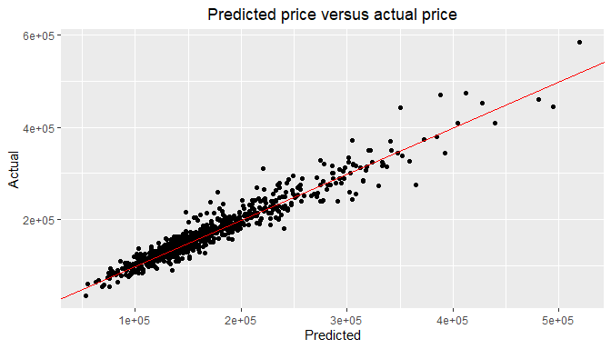<!-- -->

An example of overvalued property is \#641. The predicted price is
\$350,719 and the actual price is \$441,929 (20% higher).

An example of undervalued property is \#168. The predicted price is
\$364,895 and the actual price is \$275,000 (25% lower).

<h2>

14. Conclusion
    </h2>

The table below summarizes the statistics we collected for all the
models we created.

<table style="text-align:center;">

<tr>

<th>

Model
</th>

<th>

Predictors
</th>

<th>

R^2
</th>

<th>

Adjusted R^2
</th>

<th>

Training set RMSE
</th>

<th>

Test set RMSE
</th>

<th>

Validation set RMSE
</th>

<th>

Coverage probability
</th>

</tr>

<tr>

<td>

model.1 (initial)
</td>

<td>

10
</td>

<td>

0.9374
</td>

<td>

0.9332
</td>

<td>

17762
</td>

<td>

18967
</td>

<td>

18681
</td>

<td>

0.956
</td>

</tr>

<tr>

<td>

model.2 (enhanced)
</td>

<td>

25
</td>

<td>

0.9519
</td>

<td>

0.9458
</td>

<td>

14920
</td>

<td>

16999
</td>

<td>

17111
</td>

<td>

0.965
</td>

</tr>

<tr>

<td>

model.3 (AIC)
</td>

<td>

16
</td>

<td>

0.9503
</td>

<td>

0.946
</td>

<td>

15120
</td>

<td>

16925
</td>

<td>

17521
</td>

<td>

0.958
</td>

</tr>

<tr>

<td>

model.4 (BIC)
</td>

<td>

12
</td>

<td>

0.9473
</td>

<td>

0.9437
</td>

<td>

15693
</td>

<td>

16871
</td>

<td>

17840
</td>

<td>

0.957
</td>

</tr>

<tr>

<td>

model.5 (tuned BIC)
</td>

<td>

13
</td>

<td>

0.9384
</td>

<td>

0.9351
</td>

<td>

17282
</td>

<td>

18159
</td>

<td>

18164
</td>

<td>

0.953
</td>

</tr>

</table>

<br>

<h4>

Model Comparison:
</h4>

- **Predictive Power**: The AIC model (model.3) and the enhanced model
  (model.2) have the highest adjusted R-squared values, indicating they
  explain the most variance in the data. However, the enhanced model’s
  high number of predictors (25) makes it complex and prone to
  overfitting. The AIC model achieves a nearly identical adjusted
  R-squared (0.946 vs. 0.9458) with significantly fewer predictors (16),
  making it a more parsimonious and robust choice.

- **Generalization (Overfitting)**: Comparing the RMSE across the
  datasets is crucial for evaluating overfitting. The BIC model
  (model.4) shows the smallest difference between its training and test
  RMSE, suggesting it generalizes the best, but this comes at the cost
  of a slightly lower R-squared. The AIC model (model.3) also shows a
  small, acceptable gap between its training and test RMSE. In contrast,
  the initial and tuned models have higher RMSE values overall,
  indicating they are less accurate. The enhanced model’s larger jump in
  RMSE from training to testing hints at more overfitting compared to
  the AIC and BIC models.

- **Simplicity and Interpretability**: With only 16 predictors, the AIC
  model (model.3) is much more interpretable than the complex enhanced
  model. It is more complex than the BIC model but offers slightly
  better predictive power. The tuned BIC model (model.5), while simple,
  sacrifices too much predictive power and is not a strong contender.

The AIC-based model (model.3) appears to be the best model. It
successfully balances the trade-off between model complexity and
predictive performance. It achieves a high adjusted R-squared and low
RMSE on unseen data without the unnecessary complexity of the enhanced
model. This makes it a reliable and efficient model for predicting
housing prices in the Ames dataset.
